# ISLA LP Benchmark v1.2.0

## Resumen del Proyecto

ISLA LP Benchmark es una plataforma profesional de benchmarking para comparar multiples solvers de Programacion Lineal (LP). El sistema permite ejecutar y comparar el rendimiento de diferentes optimizadores bajo condiciones controladas, generando metricas detalladas y reportes comparativos en PDF, CSV y JSON.

Esta herramienta esta disenada para uso educativo, investigacion y evaluacion de algoritmos de optimizacion lineal.

---

## Tabla de Contenidos

1. Caracteristicas Principales
2. Arquitectura del Sistema
3. Solvers Disponibles
4. Requisitos del Sistema
5. Instalacion
6. Uso desde Linea de Comandos
7. Modo Benchmark
8. Formato de Archivos de Problemas
9. Estructura del Proyecto
10. Descripcion Tecnica de Modulos
11. Clases y Funciones Principales
12. Analisis de Sensibilidad
13. Diagnostico de Infactibilidad
14. Configuracion del Solucionador
15. Informes PDF
16. Formato CPLEX/LP
17. Validacion de Problemas
18. Docker
19. Licencia
20. Version

---

## 1. Caracteristicas Principales

| Caracteristica | Descripcion |
|-------------|-----------|
| Multiples Solvers | Comparativa de HiGHS, GLPK, CBC y Gurobi |
| Modo Benchmark | Comparacion justa con warmup y metricas detalladas |
| Metricas Detalladas | Tiempo, iteraciones, memoria, nodos |
| Warmup | Ejecuciones de calentamiento para fair benchmarking |
| Reportes PDF | Comparaciones visuales con graficos |
| Exportacion | CSV, JSON, Markdown |
| CLI Modular | Flags configurables |
| Registro de Solvers | Deteccion automatica de disponibilidad |
| Docker | Imagen Alpine ligera |

---

## 2. Arquitectura del Sistema

### 2.1 Diagrama de Componentes (Arquitectura del Sistema)

```mermaid
flowchart TB
    subgraph CLI["Capa de Presentacion - CLI"]
        direction TB
        MAIN["main.py - Punto de entrada"]
        BENCH["benchmark.py - Handler benchmark"]
        SOLVE["solve.py - Handler resolucion"]
    end
    
    subgraph SOLVER["Capa de Solucion"]
        direction TB
        BASE["base.py - BaseSolver, SolverRegistry"]
        GUROBI["gurobi.py - Gurobi"]
        HIGHS["highs_solver.py - HiGHS"]
        GLPK["glpk_solver.py - GLPK"]
        CBC["cbc.py - CBC"]
        SCIP["scip.py - SCIP"]
        ECOS["ecos.py - ECOS"]
        OSQP["osqp_solver.py - OSQP"]
        CVXOPT["cvxopt_solver.py - CVXOPT"]
        SCS["scs_solver.py - SCS"]
        IPOPT["ipopt_solver.py - Ipopt"]
        ALPINE["alpine_solver.py - Alpine"]
        BONMIN["bonmin_solver.py - Bonmin"]
        COUENNE["couenne_solver.py - Couenne"]
        SYMPHONY["symphony_solver.py - Symphony"]
        QSOPTEX["qsoptex_solver.py - QSopt_ex"]
        BENCHRUN["benchmark.py - BenchmarkRunner"]
    end
    
    subgraph PARSER["Capa de Parsing"]
        direction TB
        LP["lp_parser.py - Formato propio"]
        CPLEX["cplex_parser.py - Formato CPLEX/LP"]
    end
    
    subgraph CORE["Capa Core"]
        direction TB
        PROBLEM["problem.py - LinearProblem"]
        CONSTRAINT["constraint.py - LinearConstraint"]
        BOUND["bound.py - VariableBound"]
        SOLUTION["solution.py - Solution"]
        EXC["exceptions.py - Excepciones"]
    end
    
    subgraph MATRIX["Capa de Construccion"]
        direction TB
        BUILD["builder.py - LPBuilder"]
        POLARS["matrix.py - PolarsLP"]
    end
    
    subgraph ANALYSIS["Capa de Analisis"]
        direction TB
        AN["analysis.py - Reporte single"]
        BENCHREP["benchmark_report.py - Reporte benchmark"]
    end
    
    subgraph VIS["Capa de Visualizacion"]
        direction TB
        VISUAL["visualization.py - Graficos 2D"]
    end
    
    subgraph UTILS["Capa de Utilidades"]
        direction TB
        VAL["validation.py - Validacion"]
        EXP["exporter.py - Exportacion"]
        LOG["logging.py - Registro"]
    end
    
    CLI --> PARSER
    CLI --> SOLVER
    PARSER --> CORE
    CORE --> MATRIX
    MATRIX --> SOLVER
    SOLVER --> ANALYSIS
    SOLVER --> VIS
    CORE --> VAL
    VAL --> EXP
```

### 2.2 Flujo de Datos (Pipeline de Ejecucion)

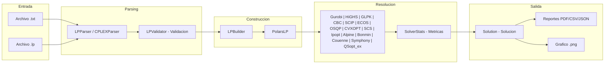

### 2.3 Flujo de Benchmark

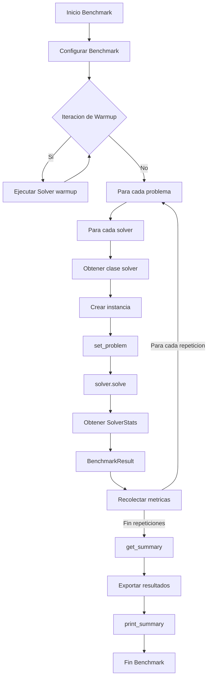

### 2.4 Diagrama de Estados del Solver

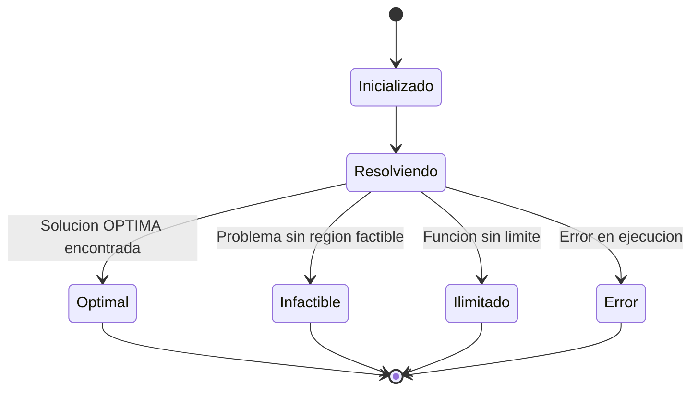

### 2.5 Capas del Sistema

| Capa | Componente | Fichero | Descripcion |
|------|-----------|---------|-------------|
| Presentacion | main.py, cli/ | Punto de entrada CLI | Gestiona argumentos y coordina ejecucion |
| Solucion | solver/ | Múltiples implementaciones | Gurobi, HiGHS, GLPK, CBC, SCIP, ECOS, OSQP, CVXOPT, SCS, Ipopt, Alpine, Bonmin, Couenne, Symphony, QSopt_ex |
| Benchmark | benchmark.py | BenchmarkRunner | Orquestador con warmup y métricas |
| Análisis | analysis.py, benchmark_report.py | Reportes PDF | Generación de informes académicos |
| Visualización | visualization.py | Gráficos 2D | Región factible matplotlib |
| Construcción | matrix/builder.py | LPBuilder | Convierte a estructuras Polars |
| Parsing | parser/ | Parsers | Interpreta archivos de entrada |
| Core | problem.py, constraint.py, bound.py, solution.py | Estructuras fundamentales | Define tipos base |
| Utilidades | validation.py, exporter.py, logging.py | Funciones auxiliares | Helpers del sistema |

### 2.6 Tabla de Clases Principales

| Clase | Módulo | Descripción | Métodos Principales |
|-------|-------|-------------|-------------------|
| LinearProblem | core/problem.py | Modelo del problema LP | parse(), validate() |
| LinearConstraint | core/constraint.py | Restricción lineal | is_active(), get_slack() |
| VariableBound | core/bound.py | Límites de variable | lower, upper |
| Solution | core/solution.py | Resultado de resolución | is_optimal(), is_infeasible() |
| BaseSolver | solver/base.py | Clase base abstracta | solve(), get_stats() |
| SolverRegistry | solver/base.py | Registro de solvers | register(), get(), list_solvers() |
| BenchmarkRunner | solver/benchmark.py | Orquestador benchmark | run(), get_summary() |
| BenchmarkResult | solver/benchmark.py | Resultado individual | to_dict() |
| LPParser | parser/lp_parser.py | Parser formato propio | parse() |
| CPLEXParser | parser/cplex_parser.py | Parser formato CPLEX | parse() |
| LPBuilder | matrix/builder.py | Constructor Polars | build() |
| LPAnalysis | analysis/analysis.py | Reporte PDF single | generate() |
| BenchmarkReport | analysis/benchmark_report.py | Reporte PDF benchmark | generate() |
| LinearVisualization | visualization/visualization.py | Gráfico 2D | plot() |
| LPValidator | utils/validation.py | Validador | validate() |
| LPExporter | utils/exporter.py | Exportador | export() |

---

### 2.7 Constantes Centralizadas (constants.py)

El módulo `src/core/constants.py` define tolerancias numéricas centralizadas para asegurar consistencia en todo el código.

**Constantes disponibles**:

| Constante | Valor | Descripción |
|-----------|-------|-------------|
| FEASIBILITY_TOLERANCE | 1e-6 | Tolerancia para verificación de factibilidad |
| OPTIMALITY_TOLERANCE | 1e-6 | Tolerancia para verificación de optimalidad |
| BOUND_TOLERANCE | 1e-9 | Tolerancia para verificación de límites |
| PARSING_TOLERANCE | 1e-10 | Tolerancia para comparaciones numéricas en parsing |
| DEFAULT_INFINITY | 1e30 | Valor predeterminado para infinito |
| HIGHS_INFINITY | 1e30 | Infinito para HiGHS |
| GLPK_INFINITY | 1e30 | Infinito para GLPK |
| CBC_INFINITY | 1e30 | Infinito para CBC |

---

## 3. Solvers Disponibles

### 3.1 Resumen de Solvers

| Solver | Paquete | API | Disponibilidad | Descripción |
|--------|--------|-----|-------------|-------------|
| **Gurobi** | gurobipy | Wrapper | Requiere licencia | Optimizador comercial lider |
| **HiGHS** | highspy | Native | Requiere instalacion | Optimizador open-source de alta eficiencia |
| **GLPK** | swiglpk | Native | Requiere instalacion | GNU Linear Programming Kit |
| **CBC** | pulp | Wrapper | Siempre disponible | COIN-OR Branch and Cut |
| **SCIP** | pyscipopt | Native | Requiere instalacion | Framework de optimizacion (MILP) |
| **ECOS** | ecos | Native | Requiere instalacion | Solver conico embebido de punto interior |
| **OSQP** | osqp | Native | Requiere instalacion | Solver de optimizacion cuadratica (ADMM) |
| **CVXOPT** | cvxopt | Native | Requiere instalacion | Solver de programacion convexa |
| **SCS** | scs | Native | Requiere instalacion | Solver conico de punto fijo (ADMM) |
| **Ipopt** | cyipopt | Native | Requiere instalacion | Solver de punto interior para NLP |
| **Alpine** | pyoptinterface | Native | Requiere instalacion | Interfaz moderna de optimizacion (HiGHS) |
| **Bonmin** | coin-or/bonmin | Pyomo | Requiere binario | Branch-and-Combine para MINLP |
| **Couenne** | coin-or/couenne | Pyomo | Requiere binario | Optimizacion global para MINLP |
| **Symphony** | coin-or/symphony | Pyomo | Requiere binario | Solver MILP con metaheuristicas |
| **QSopt_ex** | qsopt-python | Native C | Requiere binario | Solver academico con binding nativo |

### 3.2 Arquitectura de Solvers

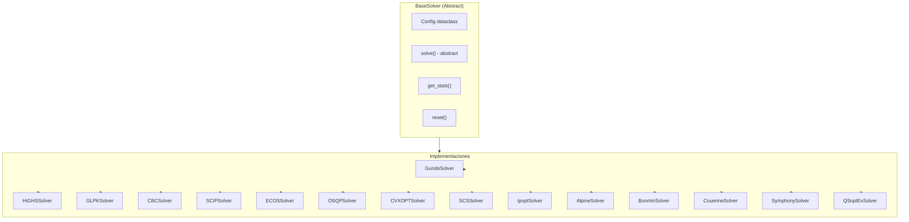

### 3.3 Detalles de Implementacion

| Solver | Fichero | Clase | Estado | Caracteristicas |
|--------|---------|-------|-------|---------------|
| Gurobi | solver/gurobi.py | GurobiSolver | Activo | Optimizacion comercial, IIS, precios sombra |
| HiGHS | solver/highs_solver.py | HiGHSSolver | Activo | API nativa, alto rendimiento |
| GLPK | solver/glpk_solver.py | GLPKSolver | Activo | API nativa, GNU GPL |
| CBC | solver/cbc.py | CBCSolver | Activo | Wrapper PuLP, COIN-OR |
| SCIP | solver/scip.py | SCIPSolver | Activo | MILP, PySCIPOpt, FOSS |
| ECOS | solver/ecos.py | ECOSSolver | Activo | Solver conico punto interior, ligero |
| OSQP | solver/osqp_solver.py | OSQPSolver | Activo | Optimizacion cuadratica, ADMM |
| CVXOPT | solver/cvxopt_solver.py | CVXOPTSolver | Activo | Programacion convexa, LP/QP/SOCP |
| SCS | solver/scs_solver.py | SCSSolver | Activo | Solver conico punto fijo, escalable |
| Ipopt | solver/ipopt_solver.py | IpoptSolver | Activo | Punto interior para NLP, no lineal |
| Alpine | solver/alpine_solver.py | AlpineSolver | Activo | PyOptInterface + HiGHS backend |
| Bonmin | solver/bonmin_solver.py | BonminSolver | Activo | Pyomo, Branch-and-Combine MINLP |
| Couenne | solver/couenne_solver.py | CouenneSolver | Activo | Pyomo, optimizacion global MINLP |
| Symphony | solver/symphony_solver.py | SymphonySolver | Activo | Pyomo, MILP con metaheuristicas |
| QSopt_ex | solver/qsoptex_solver.py | QSoptExSolver | Activo | Binding nativo C, academico |

### 3.4 Metodos de Configuracion

#### Configuracion Base (BaseSolver.Config)

| Parametro | Descripcion | Valores |
|----------|-------------|---------|
| verbose | Salida detallada | True/False |
| time_limit | Limite de tiempo (segundos) | float (>=0) |
| threads | Numero de hilos | 0=automatico, N=hilos |
| mip_gap | Tolerancia gap MIP | float (0-1) |
| presolve | Nivel de presolve | -1=auto, 0=off, 1=conservative |

#### Parametros SCIP (F4-2)

| Parametro SCIP | Equivalente Config | Descripcion |
|---------------|-------------------|-------------|
| `limits/time` | time_limit | Limite de tiempo |
| `limits/gap` | mip_gap | Tolerancia gap MIP |
| `parallel/maxnthreads` | threads | Numero de hilos |
| `limits/nodes` | - | Limite de nodos (solo SCIP) |
| `limits/sollimit` | - | Limite de soluciones (solo SCIP) |

### 3.5 Listar Solvers Disponibles

```bash
python -m src.cli --list-solvers
# o usando shortcut:
python -m src.cli -l
```

Salida (ejemplo en entorno con modulos instalados):
```

  Solvers registrados
  --------------------------------------------------
    gurobi                DISPONIBLE
    highs                 NO DISPONIBLE  (highspy not available: ...)
    glpk                  NO DISPONIBLE  (swiglpk not available: ...)
    cbc                   DISPONIBLE
    scip                  DISPONIBLE
    ecos                  DISPONIBLE
    osqp                  DISPONIBLE
    cvxopt                DISPONIBLE
    scs                   DISPONIBLE
    ipopt                 DISPONIBLE
    alpine                DISPONIBLE
    bonmin                DISPONIBLE
    couenne               DISPONIBLE
    symphony              DISPONIBLE
    qsopt_ex              DISPONIBLE

  13/15 solvers disponibles: gurobi, cbc, scip, ecos, osqp, cvxopt, scs, ipopt, alpine, bonmin, couenne, symphony, qsopt_ex
```

---

## 4. Requisitos del Sistema

| Requisito | Version Minima | Descripcion |
|----------|---------------|-------------|
| Python | 3.14 | Lenguaje de programacion |
| Memoria RAM | 4 GB (8 GB recomendado) | Para ejecucion de solvers |
| Espacio disco | 500 MB | Para instalacion de dependencias |

### Dependencias del Entorno

| Paquete | Version | Proposito |
|---------|---------|-----------|
| gurobipy | >=13.0.1 | Optimizador comercial de PL/MILP (opcional) |
| polars | >=1.39.0 | DataFrames de alto rendimiento |
| matplotlib | >=3.9.0 | Generacion de graficos 2D |
| numpy | >=2.4.3 | Computacion numerica |
| fpdf2 | >=2.7.0 | Generacion de documentos PDF |
| reportlab | >=4.4.10 | Generacion avanzada de PDFs |
| psutil | >=7.2.2 | Metricas de memoria |
| highspy | >=1.14.0 | Solver HiGHS |
| swiglpk | >=5.0.13 | Solver GLPK |
| pulp | >=3.3.0 | Solver CBC |
| ecos | >=2.0.0 | Solver conico ECOS (LP/SOCP) |
| osqp | >=0.6.0 | Solver de optimizacion cuadratica OSQP |
| cvxopt | >=1.3.0 | Solver de programacion convexa CVXOPT |
| scs | >=3.0.0 | Solver conico de punto fijo SCS |
| cyipopt | >=1.3.0 | Interfaz Python para Ipopt NLP |
| pyoptinterface | >=0.6.0 | Interfaz moderna de optimizacion |
| pyomo | >=6.7.0 | Framework de optimizacion (Bonmin, Couenne, Symphony) |

---

## 5. Instalacion

### Usando Poetry (Recomendado)

```bash
# Clonar repositorio
git clone <repo-url>
cd isla-lp-benchmark

# Instalar dependencias
poetry install

# Activar entorno virtual
poetry shell
```

### Usando pip

```bash
pip install -r requirements.txt
```

### Configurar Licencia de Gurobi (Opcional)

Gurobi requiere una licencia valida para funcionar. Obtener una licencia academica gratuita en gurobipy.com/academic o contactar a Gurobi para licencias comerciales.

```bash
grbgetkey TU_CLAVE_DE_LICENCIA
```

---

## 6. Uso desde Linea de Comandos

### 6.1 Flujo de Comandos CLI

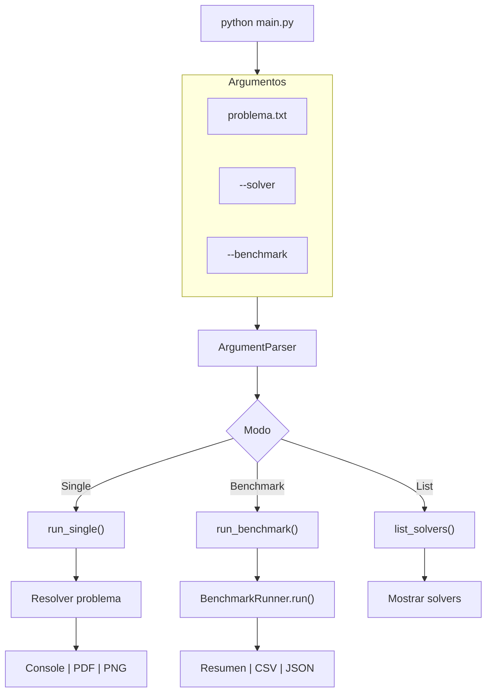

### 6.2 Tabla de Comandos Basicos

| Comando | Descripcion | Salida |
|---------|-------------|--------|
| `python -m src.cli problema.txt` | Resolver problema simple | Consola |
| `python -m src.cli problema.txt --pdf` | Generar reporte PDF | archivo.pdf |
| `python -m src.cli problema.txt --visualize` | Generar grafico 2D | archivo.png |
| `python -m src.cli problema.txt --verbose` | Salida detallada | Consola |
| `python -m src.cli problema.txt --times` | Mostrar tiempos | Consola |
| `python -m src.cli --list-solvers` | Listar solvers | Consola |
| `python -m src.cli problema.txt --json` | Salida estructurada JSON | stdout |
| `python -m src.cli problema.txt --no-solve` | Solo parsear (diagnostico) | Consola |
| `python -m src.cli --version` | Mostrar version del programa | Consola |

### 6.3 Flags CLI Completos

| Flag | Alias | Tipo | Default | Descripcion |
|------|-------|-----|---------|-------------|
| --solver | -s | str | "gurobi" | Solver a usar |
| --solvers | -S | list[str] | ["gurobi"] | Lista de solvers para benchmark |
| --all-solvers | -a | flag | False | Usar todos los solvers disponibles |
| --list-solvers | -l | flag | False | Listar solvers disponibles |
| --version | -V | flag | - | Mostrar version y salir |
| --timeout | -T | float | None | Limite de tiempo por solver (segundos) |
| --benchmark | -b | flag | False | Activar modo benchmark |
| --repetitions | -r | int | 1 | Numero de repeticiones |
| --multi | -m | flag | False | Modo multi-problema |
| --pdf | -p | flag | False | Generar reporte PDF |
| --visualize | -v | flag | False | Generar visualizacion grafica |
| --plot-comparison | -C | flag | False | Generar graficos comparativos |
| --times | -t | flag | False | Mostrar tiempos de ejecucion |
| --json | -j | flag | False | Salida en formato JSON |
| --quiet | -q | flag | False | Suprimir salida no esencial |
| --no-solve | -n | flag | False | Solo parsear sin resolver |
| --verbose | | flag | False | Salida detallada del solver |
| --output | -o | path | None | Ruta de salida (visualizacion/PDF/JSON) |
| --output-dir | -O | path | None | Directorio de salida (benchmark) |
| --output-csv | | path | None | Exportar resultados a CSV |

### 6.4 Combinaciones de Comandos

| Comando | Combinacion | Resultado |
|---------|------------|----------|
| Basic | `problema.txt` | Resolver y mostrar resultado |
| + PDF | `problema.txt --pdf` | Resolver + generar reporte |
| + Visual | `problema.txt --visualize` | Resolver + generar grafico |
| + Times | `problema.txt --times` | Resolver + mostrar metricas |
| + Verbose | `problema.txt --verbose` | Resolver + salida detallada |
| + JSON | `problema.txt --json` | Salida estructurada JSON |
| + Quiet | `problema.txt --quiet` | Solo resultado, sin extras |
| + Timeout | `problema.txt --timeout 30` | Limite de 30s por solver |
| + No-solve | `problema.txt --no-solve` | Solo parsear (diagnostico) |
| Full | `problema.txt -pvt` | Resolver + PDF + Visual + Times |
| Benchmark | `-b -S gurobi cbc` | Comparar solvers |
| + All solvers | `-b -a` | Usar todos los disponibles |
| + Repetitions | `-b -r 5` | 5 repeticiones por problema |
| + Export | `-b --output-csv results.csv` | Exportar a CSV |

### 6.5 Ejemplos de Uso Detallados

#### Resolucion Simple
```bash
python -m src.cli data/problem.txt

# Output:
# Optimal value: 190000.00
# x = 30.00
# y = 20.00
```

#### Con Opciones Multiples
```bash
python -m src.cli data/problem.txt --visualize --pdf --times --verbose
```

#### Salida JSON
```bash
python -m src.cli data/problem.txt --json
# {
#   "solver": "gurobi",
#   "status": "OPTIMAL",
#   "objective_value": 190000.0,
#   "variables": {"x": 30.0, "y": 20.0},
#   "times": {"parse_ms": 1.0, "build_ms": 8.6, "solve_ms": 22.6, "total_ms": 32.8}
# }
```

#### Solo Parsear (Diagnostico)
```bash
python -m src.cli data/problem.txt --no-solve
#
#   Problema: problem.txt
#   Variables: 2
#   Restricciones: 2
#   Tipo: max
#   Matriz: 2x2 (Polars LP)
#   Variables: x, y
```

#### Modo Benchmark
```bash
# Benchmark basico
python -m src.cli --benchmark --solvers gurobi cbc --repetitions 3 data/problem.txt

# Con atajos
python -m src.cli -b -S gurobi cbc -r 3 data/problem.txt

# Todos los solvers disponibles
python -m src.cli -b -a data/problem.txt

# Benchmark completo con graficos
python -m src.cli -b -a -C data/problem.txt
```

### 6.6 Ejemplo de Salida - Resolucion Simple

```
python -m src.cli data/problem.txt
```

Salida esperada:
```
Optimal value: 190000.00
x = 30.00
y = 20.00
```

### 6.7 Ejemplo de Salida - Modo Benchmark

```
python -m src.cli --benchmark --solvers gurobi cbc --repetitions 3 data/problem.txt
```

Salida esperada:
```
==================================================
BENCHMARK
==================================================
Problems: 1
Solvers: gurobi, cbc
Repetitions: 3
Output: data\benchmark_output
==================================================

============================================================
BENCHMARK SUMMARY
============================================================
Total de pruebas: 6
Exitosas: 6
Fallidas: 0

Por Solver:
------------------------------------------------------------
Solver          Runs     Exitosos   Tiempo Promedio
------------------------------------------------------------
highs           3        3          45.23ms
glpk            3        3          42.87ms
============================================================
```

### Ejemplo de Salida - Resolucion Simple (legacy main.py)

```
python main.py data/problem.txt
```

Salida esperada:
```
Optimal value: 190000.00
x = 30.00
y = 20.00
```

### Ejemplo de Salida - Modo Benchmark (legacy main.py)

```
python main.py --benchmark --solvers highs glpk --repetitions 3 data/problem.txt
```

Salida esperada:
```
==================================================
BENCHMARK
==================================================
Problems: 1
Solvers: highs, glpk
Repetitions: 3
Output: data\benchmark_output
==================================================

============================================================
BENCHMARK SUMMARY
============================================================
Total de pruebas: 6
Exitosas: 6
Fallidas: 0

Por Solver:
------------------------------------------------------------
Solver          Runs     Exitosos   Tiempo Promedio
------------------------------------------------------------
highs           3        3          45.23ms
glpk            3        3          42.87ms
============================================================
```

---

## 7. Modo Benchmark

### 7.1 Descripcion General

El modo benchmark permite comparar multiples solvers bajo condiciones controladas:

- **Warmup**: Ejecuciones iniciales para JIT/hotspot warmup
- **Fair Config**: Misma configuracion para todos los solvers
- **Metricas**: Tiempo, iteraciones, memoria, nodos
- **Repeticiones**: Multiple runs por problema para estadisticas

### 7.2 Flujo de Ejecucion del Benchmark

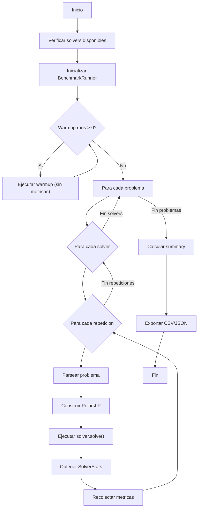

### 7.3 Configuracion del Benchmark

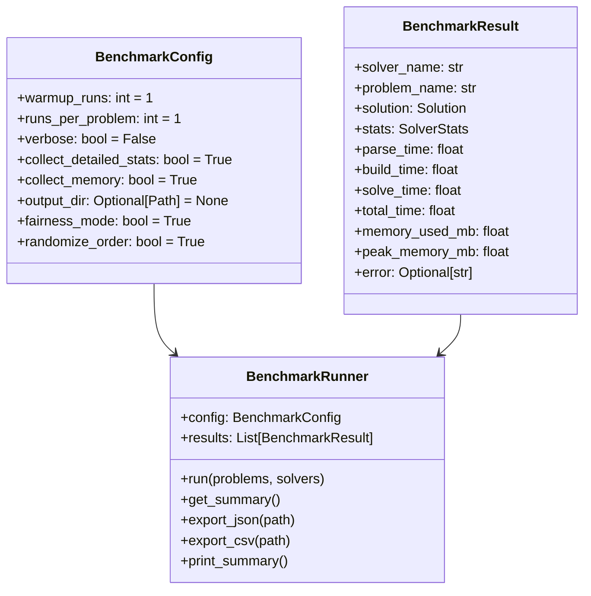

### 7.4 Metricas Recolectadas

| Metrica | Descripcion | Unidades | Recolectable |
|---------|-----------|---------|-------------|
| parse_time | Tiempo de parsing | segundos | Siempre |
| build_time | Tiempo de construccion | segundos | Siempre |
| solve_time | Tiempo de resolucion | segundos | Siempre |
| total_time | Tiempo total | segundos | Siempre |
| memory_used_mb | Memoria utilizada | MB | Si PSUTIL disponible |
| peak_memory_mb | Pico de memoria | MB | Si PSUTIL disponible |
| iterations | Iteraciones del solver | numero | Si el solver lo provee |
| nodes | Nodos explorados | numero | Si el solver lo provee |
| simplex_iterations | Iteraciones simplex | numero | Si el solver lo provee |
| barrier_iterations | Iteraciones barrera | numero | Si el solver lo provee |

### 7.5 Ejemplo de Configuracion

```python
from src.solver import BenchmarkRunner, BenchmarkConfig

config = BenchmarkConfig(
    warmup_runs=2,                # 2 ejecuciones de warmup
    runs_per_problem=5,            # 5 repeticiones por problema
    verbose=False,                 # Salida silenciosa
    collect_detailed_stats=True,      # Recolectar stats detallados
    collect_memory=True,            # Recolectar memoria
    output_dir=None,               # Directorio de salida (predeterminado)
    fairness_mode=True,             # Modo justo (misma config)
    randomize_order=True,            # Orden aleatorio de solvers
)

runner = BenchmarkRunner(config)
results = runner.run(problems, solvers)
summary = runner.get_summary()
```

### 7.6 Resumen de Resultados (get_summary)

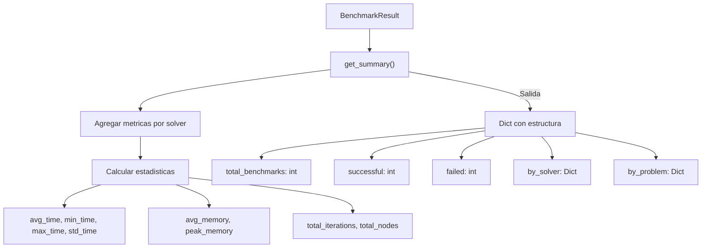

### 7.7 Estructura del Resumen

| Campo | Tipo | Descripcion |
|-------|-----|-------------|
| total_benchmarks | int | Numero total de ejecuciones |
| successful | int | Numero de ejecuciones exitosas |
| failed | int | Numero de ejecuciones fallidas |
| by_solver | Dict[str, SolverStats] | Estadisticas agrupadas por solver |
| by_problem | Dict[str, ProblemStats] | Estadisticas agrupadas por problema |

### 7.8 Stats por Solver (by_solver)

| Campo | Tipo | Descripcion |
|-------|-----|-------------|
| runs | int | Numero de ejecuciones |
| successful | int | Numero exitosas |
| avg_time | float | Tiempo promedio (segundos) |
| min_time | float | Tiempo minimo (segundos) |
| max_time | float | Tiempo maximo (segundos) |
| std_time | float | Desviacion estandar (segundos) |
| total_time | float | Tiempo total (segundos) |
| avg_memory | float | Memoria promedio (MB) |
| peak_memory | float | Pico de memoria (MB) |
| total_iterations | int | Total de iteraciones |
| total_nodes | int | Total de nodos |

### 7.9 Exportacion de Resultados

```bash
# CSV
python -m src.cli -b -S gurobi cbc --output-csv results.csv

# PDF con graficos
python -m src.cli -b -S gurobi cbc -C data/problem.txt

# JSON (salida estructurada directa)
python -m src.cli data/problem.txt --json
```

### 7.9 Exportacion HTML (con graficos)

El sistema puede generar reportes HTML interactivos con graficos embebidos.

```bash
# Generar HTML con graficos
python -c "
from src.analysis.benchmark_results import export_benchmark_results
from pathlib import Path
from src.solver import BenchmarkRunner

# Asumiendo que tienes un runner con resultados
paths = export_benchmark_results(runner, Path('data/benchmark_output'), formats=['html'], include_plots=True)
print(f'HTML generado: {paths[\"html\"]}')
"
```

**Caracteristicas del HTML**:
- Tabla resumen con estadisticas por solver
- Tabla detallada de resultados
- Graficos embebidos (tiempos, tasa de exito, perfil de rendimiento, dashboard)
- Estilos CSS integrados

---

## 8. Formato de Archivos de Problemas

### Funcion Objetivo

La funcion objetivo debe comenzar con "max:" o "min:" seguido de la expresion matematica.

Ejemplos:
```
max: 3000x + 5000y
min: 2x + 3y + 5z
```

### Restricciones

Las restricciones se expresan utilizando los simbolos de comparacion.

Ejemplos:
```
x + y <= 100         (menor o igual)
2x + 3y >= 50       (mayor o igual)
x + y = 75           (igual)
```

### Limites de Variables

Los limites definen el rango de valores que puede tomar cada variable.

Ejemplos:
```
x >= 0                (limite inferior)
y <= 50               (limite superior)
x free                (variable libre, sin limites)
0 <= x <= 100         (ambos limites simultaneamente)
```

### Variables Enteras y Binarias (MILP)

El sistema soporta variables enteras (`int`, `integer`) y binarias (`bin`, `binary`).

Ejemplos:
```
x int                # Variable entera
y binary             # Variable binaria (0 o 1)
z integer           # Equivalente a int
w bin               # Equivalente a binary
```

**Nota**: Los solvers Gurobi, HiGHS, CBC y SCIP soportan MILP. Gurobi es el más completo para este tipo de problemas.

### Comentarios

Las lineas que comienzan con el simbolo # son tratadas como comentarios y son ignoradas por el parser.

Ejemplo:
```
# Este es un comentario explicativo
max: 3x + 2y

# Restriccion de capacidad
x + y <= 10
```

### Multiples Problemas

Para definir multiples problemas en un archivo, utilize delimitadores:

```
max: 3x + 2y

x + y <= 10
2x + y <= 15

x >= 0
y >= 0

---

max: 4x + 3y

x <= 5
y <= 8

x >= 0
y >= 0
```

Delimitadores soportados: ---, ===, ___

---

## 9. Estructura del Proyecto

```
isla-lp-benchmark/
├── main.py                    # Punto de entrada CLI
├── pyproject.toml            # Configuracion Poetry
├── Dockerfile                # Imagen Docker
├── docker-compose.yml        # Orquestacion Docker
├── requirements.txt          # Dependencias pip
├── README.md                 # Documentacion principal
├── LICENSE                  # Licencia MIT
├── CONTRIBUTING.md           # Guia de contribuciones
├── data/
│   ├── problem.txt          # Problema de ejemplo
│   ├── problem_multi.txt    # Multiples problemas
│   ├── problem.png         # Grafico generado
│   ├── problem.pdf         # Reporte PDF generado
│   └── benchmark_output/    # Resultados de benchmark
├── src/
│   ├── cli/
│   │   ├── __main__.py    # Punto de entrada
│   │   ├── benchmark.py    # Handler benchmark
│   │   ├── solve.py        # Handler resolucion
│   │   └── __init__.py    # Utilidades sistema
│   ├── solver/
│   │   ├── base.py        # BaseSolver, SolverRegistry
│   │   ├── gurobi.py      # Solver Gurobi
│   │   ├── highs_solver.py # Solver HiGHS
│   │   ├── glpk_solver.py  # Solver GLPK
│   │   ├── cbc.py         # Solver CBC
│   │   ├── benchmark.py    # BenchmarkRunner
│   │   └── __init__.py
│   ├── analysis/
│   │   ├── analysis.py         # Reporte single
│   │   ├── benchmark_report.py # Reporte PDF benchmark
│   │   ├── benchmark_results.py # Visualizacion
│   │   └── __init__.py
│   ├── parser/
│   │   ├── lp_parser.py    # Parser formato propio
│   │   ├── cplex_parser.py # Parser CPLEX/LP
│   │   └── __init__.py
│   ├── core/
│   │   ├── problem.py      # LinearProblem
│   │   ├── constraint.py   # LinearConstraint
│   │   ├── bound.py       # VariableBound
│   │   ├── solution.py     # Solution
│   │   ├── exceptions.py   # Excepciones
│   │   └── __init__.py
│   ├── matrix/
│   │   ├── builder.py     # LPBuilder
│   │   ├── matrix.py      # PolarsLP
│   │   └── __init__.py
│   ├── visualization/
│   │   ├── visualization.py
│   │   └── __init__.py
│   └── utils/
│       ├── validation.py
│       ├── exporter.py
│       ├── logging.py
│       └── __init__.py
├── docs/
│   ├── USER_GUIDE.md       # Guia de usuario
│   ├── DEVELOPER_GUIDE.md   # Guia de desarrollador
│   ├── MATH_GUIDE.md       # Guia matematica
│   └── Evolucion.md         # Historial del proyecto
└── legacy/
    ├── Simplex.py           # Implementacion legacy
    ├── SimplexA.py         # Implementacion legacy
    ├── Opinion.md          # Opinion del autor
    ├── README 0.1.0 .md   # Version anterior
    └── README 1.0.0 OS.md  # Documentacion original
```

---

## 10. Descripcion Tecnica de Modulos

### 10.1 Modulo Principal (main.py)

**Ubicacion**: main.py

**Proposito**: Punto de entrada de la aplicacion CLI que gestiona los argumentos de linea de comandos y coordina la ejecucion en modo single o multi-problema.

**Funciones**:

| Funcion | Firma | Descripcion |
|---------|-------|-------------|
| main | main(argv: list[str] \| None = None) -> None | Funcion principal que parsea argumentos y ejecuta el flujo apropiado |

### 10.2 Modulo CLI (src/cli/)

#### 10.2.1 Benchmark Handler (benchmark.py)

**Proposito**: Maneja la ejecucion del modo benchmark.

**Funciones**:

| Funcion | Descripcion |
|---------|-------------|
| run_benchmark | Ejecuta el modo benchmark con multiples solvers |

#### 10.2.2 Solve Handler (solve.py)

**Proposito**: Maneja la resolucion de problemas individuales.

**Funciones**:

| Funcion | Descripcion |
|---------|-------------|
| run_single | Resuelve un problema individual |
| run_multi | Resuelve multiples problemas |

### 10.3 Modulo Solver (src/solver/)

#### 10.3.1 BaseSolver y SolverRegistry (base.py)

**Proposito**: Abstraccion base para solvers y registro de solvers disponibles.

**Diagrama de Clases**:

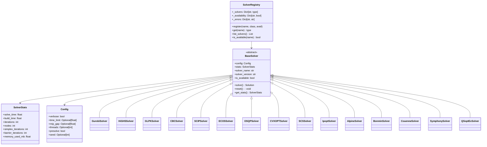

**Clases**:

| Clase | Fichero | Descripcion |
|-------|---------|-------------|
| BaseSolver | solver/base.py | Clase base abstracta para todos los solvers |
| SolverStats | solver/base.py | Estadisticas del solver (iteraciones, nodos, memoria) |
| SolverRegistry | solver/base.py | Registro dinamico de solvers |
| Config | solver/base.py | Configuracion base del solver |
| GurobiSolver | solver/gurobi.py | Solver Gurobi (comercial) |
| HiGHSSolver | solver/highs_solver.py | Solver HiGHS (open-source) |
| GLPKSolver | solver/glpk_solver.py | Solver GLPK (GNU) |
| CBCSolver | solver/cbc.py | Solver CBC (COIN-OR via PuLP) |
| SCIPSolver | solver/scip.py | Solver SCIP (MILP, PySCIPOpt) |
| ECOSSolver | solver/ecos.py | Solver conico ECOS |
| OSQPSolver | solver/osqp_solver.py | Solver cuadratico OSQP |
| CVXOPTSolver | solver/cvxopt_solver.py | Solver convexo CVXOPT |
| SCSSolver | solver/scs_solver.py | Solver conico SCS |
| IpoptSolver | solver/ipopt_solver.py | Solver NLP Ipopt |
| AlpineSolver | solver/alpine_solver.py | Interfaz PyOptInterface (HiGHS) |
| BonminSolver | solver/bonmin_solver.py | Solver MINLP Bonmin (Pyomo) |
| CouenneSolver | solver/couenne_solver.py | Solver MINLP Couenne (Pyomo) |
| SymphonySolver | solver/symphony_solver.py | Solver MILP Symphony (Pyomo) |
| QSoptExSolver | solver/qsoptex_solver.py | Solver academico QSopt_ex |


**Metodos de BaseSolver**:

| Metodo | Firma | Descripcion |
|-------|-------|-------------|
| solve | solve() -> Solution | Resuelve el problema LP (abstracto) |
| reset | reset() -> None | Reinicia el estado |
| get_stats | get_stats() -> SolverStats | Obtiene estadisticas |

**Metodos de SolverRegistry**:

| Metodo | Firma | Descripcion |
|-------|-------|-------------|
| register | register(name, class, available) | Registra un nuevo solver |
| get | get(name) -> Optional[type] | Obtiene clase del solver |
| list_solvers | list_solvers(available_only) -> List[str] | Lista solvers |
| is_available | is_available(name) -> bool | Verifica disponibilidad |
| create_solver | create_solver(name, **kwargs) -> Optional[BaseSolver] | Crea instancia |

**Metodos de SolverStats**:

| Atributo | Tipo | Descripcion |
|----------|------|-------------|
| solve_time | float | Tiempo de resolucion (segundos) |
| build_time | float | Tiempo de construccion (segundos) |
| iterations | int | Numero total de iteraciones |
| nodes | int | Numero de nodos explorados |
| simplex_iterations | int | Iteraciones simplex |
| barrier_iterations | int | Iteraciones barrera interior |
| crossover_iterations | int | Iteraciones de crossover (barrera) |
| memory_used_mb | float | Memoria utilizada (MB) |

#### 10.3.2 Solvers Implementados

| Solver | Fichero | Clase | API | Estado |
|--------|---------|-------|-----|--------|
| Gurobi | solver/gurobi.py | GurobiSolver | Wrapper (gurobipy) | Activo |
| HiGHS | solver/highs_solver.py | HiGHSSolver | Native (highspy) | Activo |
| GLPK | solver/glpk_solver.py | GLPKSolver | Native (swiglpk) | Activo |
| CBC | solver/cbc.py | CBCSolver | Wrapper (PuLP) | Activo |
| SCIP | solver/scip.py | SCIPSolver | Native (PySCIPOpt) | Activo |
| ECOS | solver/ecos.py | ECOSSolver | Native (ecos) | Activo |
| OSQP | solver/osqp_solver.py | OSQPSolver | Native (osqp) | Activo |
| CVXOPT | solver/cvxopt_solver.py | CVXOPTSolver | Native (cvxopt) | Activo |
| SCS | solver/scs_solver.py | SCSSolver | Native (scs) | Activo |
| Ipopt | solver/ipopt_solver.py | IpoptSolver | Native (cyipopt) | Activo |
| Alpine | solver/alpine_solver.py | AlpineSolver | Native (pyoptinterface) | Activo |
| Bonmin | solver/bonmin_solver.py | BonminSolver | Pyomo (bonmin) | Activo |
| Couenne | solver/couenne_solver.py | CouenneSolver | Pyomo (couenne) | Activo |
| Symphony | solver/symphony_solver.py | SymphonySolver | Pyomo (symphony) | Activo |
| QSopt_ex | solver/qsoptex_solver.py | QSoptExSolver | Native C (qsopt) | Activo |

**Diagrama de Implementaciones**:

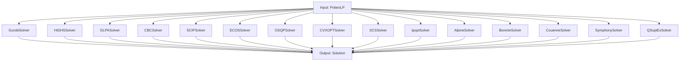

#### 10.3.3 BenchmarkRunner (benchmark.py)

**Proposito**: Orquestador de benchmarking para comparar solvers.

**Diagrama de Secuencia**:

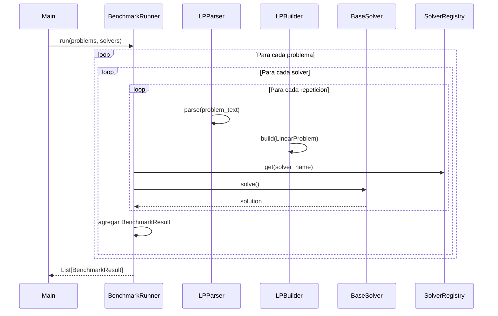

**Clase Principal**: BenchmarkRunner

| Atributo | Tipo | Descripcion |
|----------|------|-------------|
| config | BenchmarkConfig | Configuracion del benchmark |
| results | List[BenchmarkResult] | Lista de resultados |
| _solver_cache | Dict[str, BaseSolver] | Cache de instancias de solvers |

**Metodos de BenchmarkRunner**:

| Metodo | Firma | Descripcion |
|-------|-------|-------------|
| run | run(problems, solvers) -> List[BenchmarkResult] | Ejecuta el benchmark completo |
| get_summary | get_summary() -> Dict | Obtiene resumen con estadisticas |
| export_json | export_json(path) -> None | Exporta a JSON |
| export_csv | export_csv(path) -> None | Exporta a CSV |
| print_summary | print_summary() -> None | Imprime resumen en consola |

**Clase**: BenchmarkConfig

| Atributo | Tipo | Default | Descripcion |
|----------|------|----------|-------------|
| warmup_runs | int | 1 | Ejecuciones de warmup |
| runs_per_problem | int | 1 | Repeticiones por problema |
| verbose | bool | False | Salida detallada |
| collect_detailed_stats | bool | True | Recolectar stats detallados |
| collect_memory | bool | True | Recolectar memoria |
| output_dir | Optional[Path] | None | Directorio de salida |
| fairness_mode | bool | True | Modo justo |
| randomize_order | bool | True | Orden aleatorio |
| time_limit | Optional[float] | None | Limite de tiempo por solver (segundos) |

**Clase**: BenchmarkResult

| Atributo | Tipo | Descripcion |
|----------|------|-------------|
| solver_name | str | Nombre del solver |
| problem_name | str | Nombre del problema |
| problem_text | str | Texto original del problema |
| solution | Solution | Solucion encontrada |
| stats | SolverStats | Estadisticas del solver |
| parse_time | float | Tiempo de parsing |
| build_time | float | Tiempo de construccion |
| solve_time | float | Tiempo de resolucion |
| total_time | float | Tiempo total |
| memory_used_mb | float | Memoria utilizada |
| peak_memory_mb | float | Pico de memoria |
| error | Optional[str] | Error si existe |

#### 10.3.5 SCIPSolver (scip.py)

**Proposito**: Solver para programacion lineal y entera usando SCIP (PySCIPOpt).

**Diagrama de Clase**:

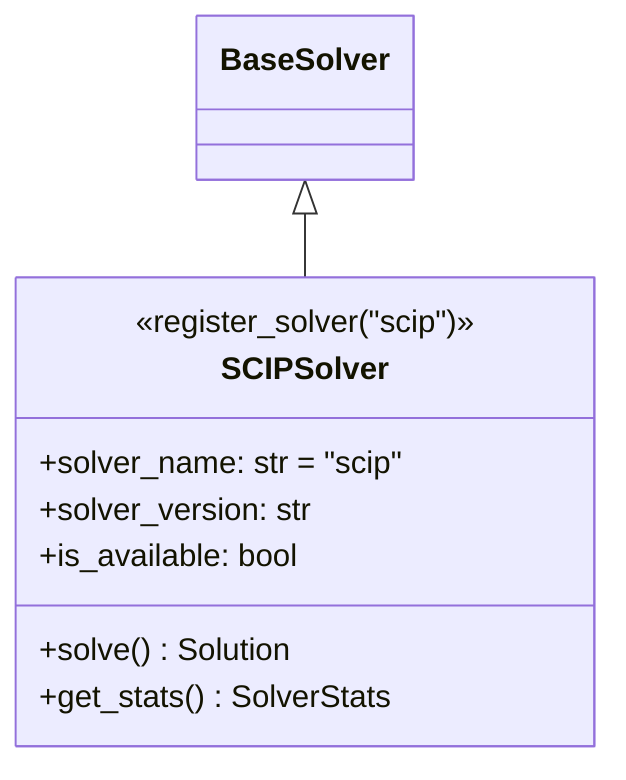

**Caracteristicas F4-2 (MILP)**:
- Soporte para variables `continuous`, `integer`, `binary`
- Configuracion via `problem.variable_types`
- Extraccion de dual values y reduced costs

**Metodos Principales**:

| Metodo | Firma | Descripcion |
|--------|-------|-------------|
| solve | solve() -> Solution | Resuelve usando SCIP |
| get_stats | get_stats() -> SolverStats | Obtiene estadisticas |

**Configuracion SCIP**:
```python
# Parametros soportados via BaseSolver.Config
model.setRealParam("limits/time", time_limit)
model.setRealParam("limits/gap", mip_gap)
model.setIntParam("parallel/maxnthreads", threads)
```

**Version**:
```python
from src.solver import SolverRegistry
registry = SolverRegistry()
info = registry.list_all_info()
print(info['scip']['version'])  # Ej: "SCIP 8.0.0"
```

---

### 10.4 Modulo de Parsing (src/parser/)

#### 10.4.1 Flujo de Parsing

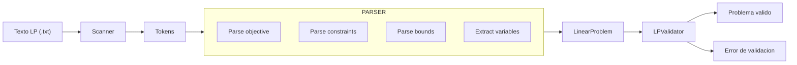

#### 10.4.2 Parser LP (lp_parser.py)

**Proposito**: Parsea problemas de programacion lineal definidos en texto plano.

**Clase Principal**: LPParser

| Atributo | Tipo | Descripcion |
|----------|------|-------------|
| txt | str | Texto con la definicion del problema LP |
| bounds | dict[str, VariableBound] | Diccionario de limites de variables |

| Metodo | Firma | Complejidad | Descripcion |
|--------|-------|-------------|-------------|
| parse | parse() -> LinearProblem | O(n×m) | Parsea el texto y retorna el problema |
| _parse_objective | _parse_objective(line) -> tuple | O(m) | Parsea la funcion objetivo |
| _parse_constraint | _parse_constraint(line) -> LinearConstraint | O(m) | Parsea una restriccion |
| _parse_linear_expression | _parse_linear_expression(expr) -> dict | O(m) | Parsea expresion lineal |
| _is_bound | _is_bound(line) -> bool | O(1) | Verifica si es un bound |
| _parse_bound | _parse_bound(line) -> None | O(1) | Parsea un bound |
| _extract_variables | _extract_variables(...) -> list | O(n×m) | Extrae nombres de variables |

#### 10.4.3 Parser CPLEX/LP (cplex_parser.py)

**Proposito**: Parsea problemas en formato LP estandar de CPLEX.

**Diagrama de Secciones**:

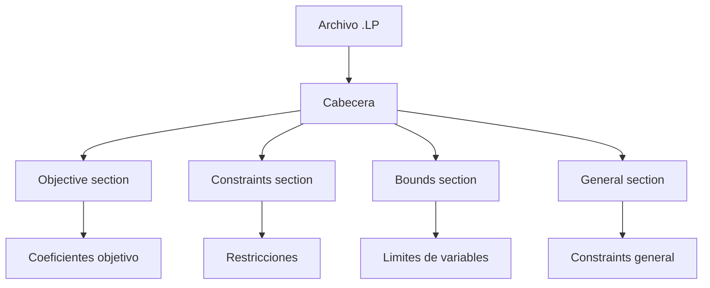

| Seccion | Palabras Clave | Descripcion |
|---------|--------------|-------------|
| Objective | Minimize, Maximize | Funcion objetivo |
| Constraints | Subject To | Restricciones lineales |
| Bounds | Bounds, General | Limites de variables |
| General | General, Integer, Binary | Variables enteras/binarias |

| Metodo | Firma | Descripcion |
|--------|-------|-------------|
| parse | parse() -> LinearProblem | Parsea archivo formato CPLEX/LP |
| _parse_section | _parse_section(lines, section) -> dict | Parsea una seccion |
| _normalize_sense | _normalize_sense(sense) -> str | Normaliza sentido optimizacion |

#### 10.4.4 Parser Multi-Problema (multi_parser.py)

**Proposito**: Parsea multiples problemas de LP desde un unico archivo.

**Diagrama de Delimiters**:

```mermaid
flowchart TB
    TEXT["Archivo con multiples problemas"] --> SPLIT["Split por delimiters"]
    SPLIT --> prob1["Problema 1"]
    SPLIT --> prob2["Problema 2"]
    SPLIT --> probN["Problema N"]
    
    prob1 --> LPPARSER1["LPParser"]
    prob2 --> LPPARSER2["LPParser"]
    probN --> LPPARSERN["LPParser"]
    
    LPPARSER1 --> LP1["LinearProblem"]
    LPPARSER2 --> LP2["LinearProblem"]
    LPPARSERN --> LPN["LinearProblem"]
```

**Clase Principal**: MultiLPParser

**Constantes**:
```
DELIMITERS = ['---', '===', '___']
```

| Metodo | Firma | Descripcion |
|--------|-------|-------------|
| parse_all | parse_all() -> List[LinearProblem] | Parsea todos los problemas |
| _split_by_delimiter | _split_by_delimiter(txt) -> List[str] | Divide usando delimiters |
| count_problems | count_problems(txt) -> int | Cuenta problemas sin parsear |

### 10.5 Modulo Core (src/core/)

#### 10.5.1 Diagrama de Relaciones

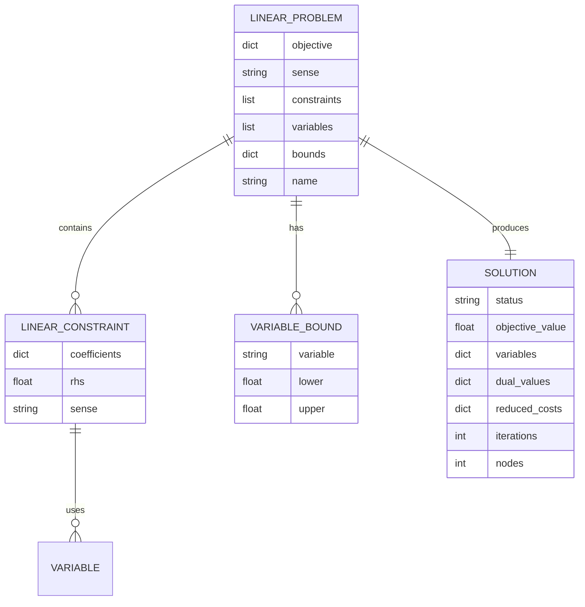

#### 10.5.2 LinearProblem (problem.py)

**Proposito**: Representa la definicion completa de un problema LP.

**Clase**: LinearProblem (dataclass)

| Atributo | Tipo | Descripcion | Requerido |
|----------|------|-------------|----------|
| objective | dict[str, float] | Coeficientes de la funcion objetivo | Si |
| sense | str | Direccion de optimizacion ("max" o "min") | Si |
| constraints | list[LinearConstraint] | Lista de restricciones lineales | Si |
| variables | list[str] | Lista de nombres de variables | Si |
| bounds | dict[str, VariableBound] | Limites de cada variable | No |
| name | str | Nombre opcional del problema | No |

**Propiedades**:
| Metodo | Retorno | Descripcion |
|--------|--------|-------------|
| num_variables | int | Numero de variables |
| num_constraints | int | Numero de restricciones |
| is_maximization | bool | True si es maximizacion |

#### 10.5.3 LinearConstraint (constraint.py)

**Proposito**: Representa una ecuacion o inecuacion lineal.

**Clase**: LinearConstraint (dataclass)

| Atributo | Tipo | Descripcion |
|----------|------|-------------|
| coefficients | dict[str, float] | Coeficientes de las variables |
| rhs | float | Lado derecho de la restriccion |
| sense | str | Tipo de restriccion ("<=", ">=", "=") |

**Sentidos validos**:
| Simbolo | Nombre | Descripcion |
|--------|--------|-------------|
| <= | Menor o igual | Restriccion de tipo上限 |
| >= | Mayor o igual | Restriccion de tipo下限 |
| = | Igual | Restriccion de igualdad |

**Metodos**:
| Metodo | Firma | Descripcion |
|--------|-------|-------------|
| evaluate | evaluate(vars) -> float | Evalua la restriccion en un punto |
| get_slack | get_slack(vars) -> float | Calcula la holgura |
| is_active | is_active(vars, tolerance) -> bool | Verifica si esta activa |

#### 10.5.4 VariableBound (bound.py)

**Proposito**: Define los limites inferior y superior de una variable.

**Clase**: VariableBound (dataclass)

| Atributo | Tipo | Descripcion | Default |
|----------|------|-------------|----------|
| variable | str | Nombre de la variable | - |
| lower | float \| None | Limite inferior | None |
| upper | float \| None | Limite superior | None |

**Formatos de bound soportados**:

| Formato | Interpretation |
|---------|--------------|
| x >= 0 | lower = 0, upper = None |
| x <= 50 | lower = None, upper = 50 |
| x free | lower = None, upper = None |
| 0 <= x <= 100 | lower = 0, upper = 100 |

#### 10.5.5 Solution (solution.py)

**Proposito**: Contiene el resultado de resolver un problema.

**Clase**: Solution (dataclass)

| Atributo | Tipo | Descripcion | Default |
|----------|------|-------------|----------|
| status | str | Estado de la solucion | "UNKNOWN" |
| objective_value | float \| None | Valor optimo | None |
| variables | dict[str, float] | Valores de las variables | {} |
| dual_values | dict[str, float] | Valores duales (precios sombra) | {} |
| reduced_costs | dict[str, float] | Costos reducidos | {} |
| iterations | int | Iteraciones del solver | 0 |
| nodes | int | Nodos explorados | 0 |

**Estados de solucion**:

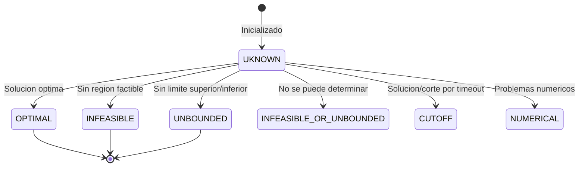

**Metodos**:
| Metodo | Firma | Descripcion |
|--------|-------|-------------|
| is_optimal | is_optimal() -> bool | Verifica si es OPTIMAL |
| is_infeasible | is_infeasible() -> bool | Verifica si es INFEASIBLE |
| is_unbounded | is_unbounded() -> bool | Verifica si es UNBOUNDED |
| is_feasible | is_feasible() -> bool | Verifica si es factible |

#### 10.5.6 Excepciones (exceptions.py)

**Jerarquia de excepciones**:

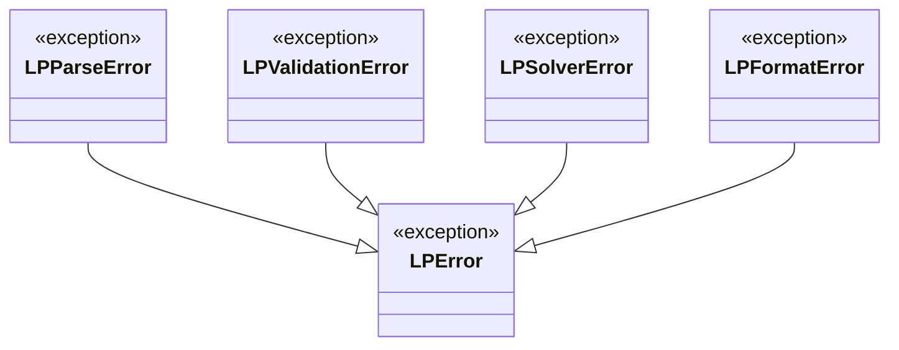

| Excepcion | Descripcion | Hereda de |
|-----------|-------------|----------|
| LPError | Excepcion base para errores de PL | Exception |
| LPParseError | Error al parsear un problema | LPError |
| LPValidationError | Error de validacion | LPError |
| LPSolverError | Error del solver | LPError |
| LPFormatError | Error de formato | LPError |

#### 10.5.7 Verificacion de Soluciones (verification.py)

**Proposito**: Verifica que las soluciones satisfagan todas las restricciones y limites de variables (F0-3, F6-2).

**Diagrama de Verificacion**:

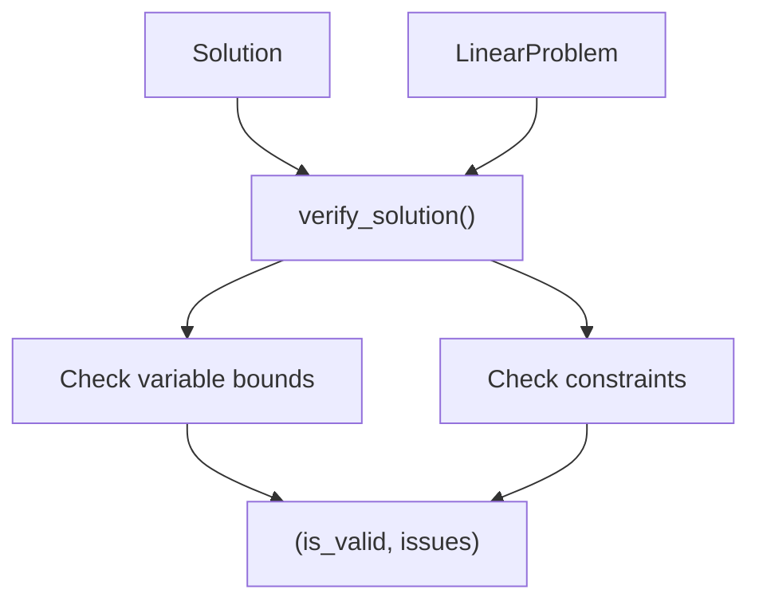

**Funciones Principales**:

| Funcion | Firma | Descripcion |
|---------|-------|-------------|
| verify_solution | verify_solution(problem, solution, tolerance) -> tuple[bool, list[str]] | Verifica solucion contra restricciones y bounds |
| compare_solutions | compare_solutions(problem, solutions, tolerance) -> list[str] | Compara multiples soluciones del mismo problema |

**Ejemplo de Uso**:

```python
from src.core.verification import verify_solution, compare_solutions
from src.core import LinearProblem, Solution

# Verificar una solucion
is_valid, issues = verify_solution(problem, solution)
if not is_valid:
    print("Problemas encontrados:")
    for issue in issues:
        print(f"  - {issue}")

# Comparar soluciones de multiples solvers
solutions = [gurobi_sol, highs_sol, glpk_sol]
warnings = compare_solutions(problem, solutions)
for warning in warnings:
    print(f"ADVERTENCIA: {warning}")
```

**Tolerancias**: Usa `FEASIBILITY_TOLERANCE` (1e-6) por defecto, configurable via parametro `tolerance`.

---

### 10.6 Modulo Matrix (src/matrix/)

#### 10.6.1 Flujo de Construccion

```mermaid
flowchart LR
    PROBLEM["LinearProblem"] --> BUILDER["LPBuilder"]
    
    subgraph BUILDER ["Constructor"]
        DIR["direction TB"]
        OBJ["build_objective()"]
        CONST["build_constraints()"]
        COEF["build_coefficients()"]
        BND["build_bounds()"]
    end
    
    BUILDER --> POLARS["PolarsLP"]
    POLARS --> SOLVER["Solver"]
    
    OBJ --> OBJ_DF["pl.DataFrame"]
    CONST --> CONST_DF["pl.DataFrame"]
    COEF --> COEF_DF["pl.DataFrame"]
    BND --> BND_DF["pl.DataFrame"]
```

#### 10.6.2 LPBuilder (builder.py)

**Proposito**: Construye estructuras de datos Polars para representar el problema LP.

**Clase Principal**: LPBuilder

| Atributo | Tipo | Descripcion |
|----------|------|-------------|
| problem | LinearProblem | Problema LP a construir |
| sense | str | Sentido de optimizacion |

| Metodo | Firma | Descripcion |
|--------|-------|-------------|
| build | build() -> PolarsLP | Construye el objeto PolarsLP con DataFrames |
| _build_objective | _build_objective() -> pl.DataFrame | Construye DataFrame objetivo |
| _build_constraints | _build_constraints() -> pl.DataFrame | Construye DataFrame restricciones |
| _build_coefficients | _build_coefficients() -> pl.DataFrame | Construye matriz de coeficientes |
| _build_bounds | _build_bounds() -> pl.DataFrame | Construye DataFrame limites |

#### 10.6.3 PolarsLP (matrix.py)

**Proposito**: Estructura de datos Polars para el problema LP.

**Clase**: PolarsLP (dataclass)

| Atributo | Tipo | Descripcion |
|----------|------|-------------|
| objective | pl.DataFrame | DataFrame con coeficientes objetivo |
| constraints | pl.DataFrame | DataFrame con restricciones |
| coefficients | pl.DataFrame | DataFrame con matriz de coeficientes |
| bounds | pl.DataFrame | DataFrame con limites de variables |
| sense | str | Sentido de optimizacion ("max" o "min") |

**Estructura del DataFrame objetivo**:

| Columna | Tipo | Descripcion |
|---------|------|-------------|
| variable | str | Nombre de la variable |
| coefficient | float | Coeficiente en la funcion objetivo |

**Estructura del DataFrame restricciones**:

| Columna | Tipo | Descripcion |
|---------|------|-------------|
| name | str | Nombre de la restriccion |
| lhs | float | Lado izquierdo evaluado en solucion |
| rhs | float | Lado derecho |
| sense | str | Sentido (<=, >=, =) |
| slack | float | Holgura (rhs - lhs) |

**Estructura del DataFrame coefficients**:

| Columna | Tipo | Descripcion |
|---------|------|-------------|
| constraint | str | Nombre de la restriccion |
| variable | str | Nombre de la variable |
| coefficient | float | Coeficiente |

**Estructura del DataFrame bounds**:

| Columna | Tipo | Descripcion |
|---------|------|-------------|
| variable | str | Nombre de la variable |
| lower | float | Limite inferior |
| upper | float | Limite superior |

### 10.7 Modulo de Analisis (src/analysis/)

#### 10.7.1 Flujo de Generacion de Reportes

```mermaid
flowchart TB
    INPUT["LinearProblem + Solution"] --> REPORT["Generation"]
    
    subgraph REPORT["Tipo de Reporte"]
        SINGLE["LPAnalysis"]
        BENCH["BenchmarkReport"]
    end
    
    SINGLE --> PDF["PDF Single Problem"]
    BENCH --> PDF_BENCH["PDF Benchmark"]
    
    PDF -->|"Secciones"| SECTIONS["1. Portada<br>2. Resumen<br>3. Datos<br>4. Solucion<br>5. Holgura<br>6. Sensibilidad<br>7. Grafico"]
    PDF_BENCH -->|"Secciones"| SECTIONS_B["1. Portada<br>2. Estadisticas<br>3. Ranking<br>4. Comparacion<br>5. Detalles<br>6. Problemas<br>7. Graficos"]
```

#### 10.7.2 LPAnalysis (analysis.py)

**Proposito**: Genera reportes academicos profesionales en formato PDF para un problema individual.

**Clase Principal**: LPAnalysis

**Diagrama de Paginas**:

```mermaid
flowchart LR
    PG1["1. Portada"] --> PG2["2. Resumen Ejecutivo"]
    PG2 --> PG3["3. Datos del Problema"]
    PG3 --> PG4["4. Solucion Optima"]
    PG4 --> PG5["5. Analisis de Holgura"]
    PG5 --> PG6["6. Analisis de Sensibilidad"]
    PG6 --> PG7["7. Grafico (2 variables)"]
```

| Atributo | Tipo | Descripcion |
|----------|------|-------------|
| problem | LinearProblem | Problema resuelto |
| solution | Solution | Solucion encontrada |
| output_path | Path | Ruta de salida del PDF |

| Metodo | Firma | Descripcion |
|--------|-------|-------------|
| generate | generate(problem, solution) -> None | Genera el PDF completo |
| _agregar_portada | _agregar_portada() -> None | Agrega portada |
| _agregar_resumen | _agregar_resumen() -> None | Agrega resumen ejecutivo |
| _agregar_datos | _agregar_datos() -> None | Agrega datos del problema |
| _agregar_solucion | _agregar_solucion() -> None | Agrega solucion optima |
| _agregar_holgura | _agregar_holgura() -> None | Agrega analisis de holgura |
| _agregar_sensibilidad | _agregar_sensibilidad() -> None | Agrega analisis de sensibilidad |
| _agregar_grafico | _agregar_grafico() -> None | Agrega grafico si aplica |

**Constantes de Estilo**:

| Constante | Valor | Descripcion |
|-----------|-------|-------------|
| PAGE_WIDTH | 215.9 | mm (carta) |
| PAGE_HEIGHT | 279.4 | mm |
| MARGIN | 20 | mm |
| COLOR_PRIMARY | (0, 51, 102) | Azul oscuro |
| COLOR_SUCCESS | (0, 128, 0) | Verde |
| COLOR_ERROR | (200, 0, 0) | Rojo |

#### 10.7.3 BenchmarkReport (benchmark_report.py)

**Proposito**: Genera reportes PDF para benchmarking multi-solver.

**Diagrama de Contenido**:

```mermaid
flowchart TB
    COVER["1. Portada"] --> STATS["2. Resumen Estadistico"]
    STATS --> RANK["3. Ranking por Velocidad"]
    RANK --> COMP["4. Comparacion por Solver"]
    COMP --> DETAIL["5. Resultados Detallados"]
    DETAIL --> PROBS["6. Definiciones de Problemas"]
    PROBS --> CHARTS["7. Graficos Comparativos"]
    CHARTS --> SYS["8. Informacion del Sistema"]
```

**Clase Principal**: BenchmarkReport

| Seccion | Contenido | Paginas |
|---------|-----------|----------|
| Portada | Titulo, fecha, configuracion | 1 |
| Resumen Estadistico | Total pruebas, exitos, fallidos | 1-2 |
| Ranking por Velocidad | Tabla ordenada por tiempo | 1 |
| Comparacion por Solver | Stats detallados por solver | 2-3 |
| Resultados Detallados | Tabla completa de resultados | variable |
| Definiciones de Problemas | Textos originales | variable |
| Graficos Comparativos | Barras de tiempo, exito, memoria | 1-2 |
| Informacion del Sistema | Plataforma, versiones | 1 |

| Metodo | Firma | Descripcion |
|--------|-------|-------------|
| generate | generate(results, config) -> None | Genera el PDF benchmark |
| _agregar_portada | _agregar_portada() -> None | Agrega portada |
| _agregar_resumen | _agregar_resumen() -> None | Agrega resumen estadistico |
| _agregar_ranking | _agregar_ranking() -> None | Agrega ranking |
| _agregar_comparacion | _agregar_comparacion() -> None | Agrega comparacion por solver |
| _agregar_detalles | _agregar_detalles() -> None | Agrega resultados detallados |
| _agregar_graficos | _agregar_graficos() -> None | Agrega graficos |
| _agregar_sistema | _agregar_sistema() -> None | Agrega info del sistema |

#### 10.7.4 MultiLPAnalysis (multi_analysis.py)

**Proposito**: Genera reportes academicos para multiples problemas de LP.

**Clase Principal**: `MultiLPAnalysis`

**Secciones del Reporte**:
1. Portada con estadisticas generales
2. Resumen ejecutivo con tabla de resultados
3. Pagina individual por problema (funcion objetivo, restricciones, solucion, holguras, grafico)
4. Resumen de tiempos por problema

**Metodos Principales**:

| Metodo | Firma | Descripcion |
|--------|-------|-------------|
| generate_pdf | generate_pdf(output_path) -> None | Genera PDF multi-problema |
| _build_portada | _build_portada(pdf) -> None | Construye portada |
| _build_resumen | _build_resumen(pdf) -> None | Construye resumen ejecutivo |
| _build_problema_individual | _build_problema_individual(pdf, result, num) -> None | Pagina por problema |
| _build_tiempos_resumen | _build_tiempos_resumen(pdf) -> None | Resumen de tiempos |

**Uso**:
```python
from src.analysis.multi_analysis import MultiLPAnalysis
from src.solver import MultiSolverResult

analysis = MultiLPAnalysis(results)  # results: MultiSolverResult
analysis.generate_pdf("output/multi_report.pdf")
```

#### 10.7.5 ResultsExporter y export_benchmark_results (benchmark_results.py)

**Proposito**: Exporta resultados de benchmarking a multiples formatos.

**Clase Principal**: `ResultsExporter`

| Metodo | Firma | Descripcion |
|--------|-------|-------------|
| to_markdown | to_markdown(path) -> None | Exporta a Markdown |
| to_html | to_html(path, include_plots, plots_dir) -> None | Exporta a HTML con graficos |
| to_polars_dataframe | to_polars_dataframe() -> pl.DataFrame | Convierte a Polars DataFrame |

**Funcion Auxiliar**: `export_benchmark_results()`

```python
from src.analysis.benchmark_results import export_benchmark_results
from pathlib import Path

paths = export_benchmark_results(
    runner=runner,
    output_dir=Path("data/benchmark_output"),
    formats=["json", "csv", "md", "html"],
    include_plots=True
)
# Retorna: {"json": Path(...), "csv": Path(...), "md": Path(...), "html": Path(...)}
```

**Formatos Soportados**:
- **JSON**: `benchmark_results.json`
- **CSV**: `benchmark_results.csv`
- **Markdown**: `benchmark_report.md`
- **HTML**: `benchmark_report.html` (incluye graficos embebidos)

---

### 10.8 Modulo de Visualizacion (src/visualization/)

#### 10.8.1 Flujo de Visualizacion

```mermaid
flowchart TB
    PROBLEM["LinearProblem"] --> SOL["Solution"]
    PROBLEM --> FINDER["find_feasible_vertices"]
    SOL --> FINDER
    
    FINDER --> PLOT["LinearVisualization"]
    
    subgraph PLOT ["Generacion de Grafico"]
        RANGE["_calculate_plot_range()"]
        CONSTRS["_plot_constraints()"]
        REGION["_plot_feasible_region()"]
        INTER["_plot_intersections()"]
        SOLPT["_plot_solution()"]
        CONTOUR["_plot_objective_contour()"]
    end
    
    PLOT --> OUTPUT["grafico.png"]
```

#### 10.8.2 LinearVisualization (visualization.py)

**Proposito**: Genera representaciones graficas de la region factible para problemas de dos variables.

**Clase Principal**: LinearVisualization

| Atributo | Tipo | Descripcion |
|----------|------|-------------|
| problem | LinearProblem | Problema de programacion lineal |
| solution | Solution \| None | Solucion optima (opcional) |
| var_x | str | Nombre de la primera variable |
| var_y | str | Nombre de la segunda variable |

**Metodos**:

| Metodo | Firma | Descripcion |
|--------|-------|-------------|
| find_intersection | find_intersection(c1, c2) -> Optional[tuple] | Encuentra interseccion entre restricciones |
| is_point_feasible | is_point_feasible(x, y, constraints) -> bool | Verifica factibilidad |
| get_constraint_line_x | get_constraint_line_x(c, x_range) -> tuple | Obtiene puntos para graficar |
| find_feasible_vertices | find_feasible_vertices() -> list[tuple] | Encuentra vertices de region factible |
| plot | plot(save_path, show) -> None | Genera la visualizacion completa |
| _calculate_plot_range | _calculate_plot_range() -> tuple | Calcula rango del grafico |
| _plot_constraints | _plot_constraints(ax) -> None | Grafica las rectas de restricciones |
| _plot_feasible_region | _plot_feasible_region(ax) -> None | Grafica la region factible |
| _plot_intersections | _plot_intersections(ax) -> None | Grafica puntos de interseccion |
| _plot_solution | _plot_solution(ax) -> None | Grafica la solucion optima |
| _plot_objective_contour | _plot_objective_contour(ax) -> None | Grafica lineas de nivel |

**Elementos del Grafico**:

| Elemento | Color | Descripcion |
|----------|-------|-------------|
| Region factible | Verde (alpha=0.3) | Area de soluciones factibles |
| Restricciones | Azul, Rojo, etc. | Rectas de restricciones |
| Vertices | Puntos negros | Puntos de interseccion |
| Solucion optima | Estrella roja | Punto optimo |
| Lineas de nivel | Lineas punteadas | Curvas de nivel del objetivo |

### 10.9 Modulo de Utilidades (src/utils/)

#### 10.9.1 Validacion (validation.py)

**Proposito**: Valida problemas de programacion lineal antes de resolverlos.

**Diagrama de Validaciones**:

```mermaid
flowchart TB
    INPUT["LinearProblem"] --> VAL["LPValidator"]
    
    subgraph VAL ["Verificaciones"]
        OBJ["Validar objetivo"]
        CONST["Validar restricciones"]
        BND["Validar bounds"]
        VAR["Validar variables"]
    end
    
    VAL --> RESULT["ValidationResult"]
    RESULT --> OK["is_valid: True"]
    RESULT --> ERROR["is_valid: False"]
```

**Clase Principal**: LPValidator

| Metodo | Firma | Descripcion |
|--------|-------|-------------|
| validate | validate(problem) -> ValidationResult | Valida un problema |
| _validate_objective | _validate_objective(problem) -> list[str] | Valida funcion objetivo |
| _validate_constraints | _validate_constraints(problem) -> list[str] | Valida restricciones |
| _validate_bounds | _validate_bounds(problem) -> list[str] | Valida limites |

**Clase de Resultado**: ValidationResult

| Atributo | Tipo | Descripcion |
|----------|------|-------------|
| is_valid | bool | Indica si el problema es valido |
| errors | list[str] | Lista de errores encontrados |
| warnings | list[str] | Lista de advertencias |

**Verificaciones Realizadas**:

| Verificacion | Descripcion | Severidad |
|-------------|-------------|----------|
| Objetivo vacio | La funcion objetivo debe tener al menos una variable | Error |
| Variables indefinidas | Todas las variables usadas deben estar definidas | Error |
| Restricciones invalidas | Las restricciones deben tener coeficientes validos | Error |
| Bounds inconsistentes | lower no puede ser mayor que upper | Error |
| Coeficientes cero | Advertencia sobre coeficientes cero | Warning |

#### 10.9.2 Exportacion (exporter.py)

**Proposito**: Exporta problemas al formato LP estandar de CPLEX.

**Diagrama de Exportacion**:

```mermaid
flowchart LR
    LP["LinearProblem"] --> EXP["LPExporter"]
    
    subgraph EXP ["Secciones"]
        OBJ["_format_objective()"]
        CONST["_format_constraints()"]
        BND["_format_bounds()"]
    end
    
    EXP --> OUTPUT["Formato CPLEX/LP"]
```

**Clase Principal**: LPExporter

| Metodo | Firma | Descripcion |
|--------|-------|-------------|
| export | export(problem) -> str | Exporta problema a formato LP |
| _format_objective | _format_objective(obj, sense) -> str | Formatea funcion objetivo |
| _format_constraints | _format_constraints(constraints) -> str | Formatea restricciones |
| _format_bounds | _format_bounds(bounds) -> str | Formatea limites |

**Formato de Salida**:

```
\Problem Name: LP
\Objective Sense: Maximize

\Columns: 2
x y

\Rows: 2
R1 R2

\Column Names:
x y

\Row Names:
R1 R2

\Objective:
3 2

\R1
1 1
<= 10

\R2
2 1
<= 15

\Bounds
x L 0
y L 0

\End
```

#### 10.9.3 Registro (logging.py)

**Proposito**: Proporciona utilidades de registro y medicion de tiempos.

**Clase Principal**: ExecutionTimes

| Atributo | Tipo | Descripcion |
|----------|------|-------------|
| parse_time | float | Tiempo de parseo |
| build_time | float | Tiempo de construccion |
| solve_time | float | Tiempo de resolucion |
| visualize_time | float | Tiempo de visualizacion |
| pdf_time | float | Tiempo de generacion PDF |

| Metodo | Firma | Descripcion |
|--------|-------|-------------|
| total | total() -> float | Tiempo total de ejecucion |
| summary | summary() -> str | Resumen formateado |

**Ejemplo de Uso**:

```python
from src.utils.logging import ExecutionTimes

times = ExecutionTimes()
times.parse_time = 0.015
times.build_time = 0.008
times.solve_time = 0.052

print(f"Total: {times.total():.3f}s")
print(times.summary())
```

---

## 11. Clases y Funciones Principales

### LinearProblem

**Ubicacion**: src/core/problem.py

**Descripcion**: Representa la definicion completa de un problema de programacion lineal.

### LinearConstraint

**Ubicacion**: src/core/constraint.py

**Descripcion**: Representa una ecuacion o inecuacion lineal.

### VariableBound

**Ubicacion**: src/core/bound.py

**Descripcion**: Define los limites inferior y superior de una variable.

### Solution

**Ubicacion**: src/core/solution.py

**Descripcion**: Contiene el resultado de resolver un problema.

### BenchmarkRunner

**Ubicacion**: src/solver/benchmark.py

**Descripcion**: Orquestador de benchmarking para comparar solvers.

### SolverRegistry

**Ubicacion**: src/solver/base.py

**Descripcion**: Registro de solvers disponibles con deteccion de disponibilidad.

---

## 12. Analisis de Sensibilidad

El sistema proporciona analisis de sensibilidad completo para ayudar a interpretar los resultados.

### 12.1 Tabla de Conceptos

| Concepto | Nombre Ingles | Descripcion | Disponible en |
|----------|--------------|-------------|----------------|
| Precio Sombra | Shadow Price | Cambio marginal en el objetivo | Gurobi, HiGHS, GLPK |
| Costo Reducido | Reduced Cost | Mejora potencial por unidad | Gurobi, HiGHS, GLPK |
| Holgura | Slack | Exceso/defecto de restriccion | Todos |
| Valor Dual | Dual Value | Ver precio sombra | Todos |

### 12.2 Precios Sombra (Shadow Prices)

**Definicion**: Los precios sombra (tambien conocidos como valores duales) representan el cambio marginal en el valor optimo de la funcion objetivo cuando se relaja una restriccion por una unidad.

**Formula matematica**:
```
yi = dZ/d(bi)
```
Donde `yi` es el precio sombra de la restriccion `i` y `bi` es su lado derecho.

**Diagrama de Interpretacion**:

```mermaid
flowchart LR
    RESTR["Restriccion i"] --> CALC["Calcular derivada"]
    CALC -->|"dZ = 1"| SHADOW["yi = dZ/d(bi)"]
    SHADOW --> VAL{"Valor de yi"}
    VAL -->|"yi > 0"| POS["Positivo: mejorar limite beneficia objetivo"]
    VAL -->|"yi = 0"| ZERO["Cero: restriccion no es limitante"]
    VAL -->|"yi < 0"| NEG["Negativo: aumentar limite perjudica"]
```

**Tabla de Interpretacion**:

| Valor | Interpretacion | Accion Recomendada |
|-------|---------------|-------------------|
| > 0 | Mejorar el limite beneficia el objetivo | Incrementar lado derecho |
| = 0 | Restriccion no esta limitando | No es prioritaria |
| < 0 | Aumentar el limite perjudica | Decrecer lado derecho |

### 12.3 Costos Reducidos (Reduced Costs)

**Definicion**: Los costos reducidos indican cuanto mejoraria el objetivo si una variable que actualmente esta en su limite inferior pudiera incrementarse.

**Formula matematica**:
```
cj = cj - yTa(j)
```
Donde `cj` es el costo reducido de la variable `j`.

**Diagrama de Interpretacion**:

```mermaid
flowchart LR
    VAR["Variable xj"] --> EVAL["Evaluar en solucion"]
    EVAL -->|"En bound?" --> BOUND{"Tipo de bound"}
    BOUND -->|"En lower"| LOWER["Calcular costo reducido"]
    BOUND -->|"En upper"| UPPER["Calcular costo reducido"]
    BOUND -->|"Interior"| ZERO["Costo reducido = 0"]
    
    LOWER -->|"cj > 0"| POS["Necesita aumentar"]
    LOWER -->|"cj = 0"| AT_OPT["En valor optimo"]
    LOWER -->|"cj < 0"| NEG["Necesita disminuir"]
```

**Tabla de Interpretacion**:

| Valor | Interpretacion | Significado |
|-------|---------------|-------------|
| = 0 | Variable en su valor optimo | No mejorar |
| > 0 | Necesita aumentar para mejorar objetivo | Variable en lower bound |
| < 0 | Necesita disminuir para mejorar objetivo | Variable en upper bound |

### 12.4 Holgura (Slack)

**Definicion**: La holgura (slack) representa la diferencia entre el lado derecho de una restriccion y el valor de la expresion evaluada en el punto optimo.

**Formula matematica**:
```
Slack = RHS - LHS
```

| Tipo Restriccion | Formula Slack |
|-----------------|---------------|
| <= | slack = rhs - (ax) |
| >= | slack = (ax) - rhs |
| = | slack = 0 (siempre) |

**Tabla de Interpretacion**:

| Valor | Interpretacion | Estado |
|-------|---------------|--------|
| 0 | La restriccion esta activa | Limitante |
| > 0 | Recursos no utilizados | No limitante |
| < 0 | Restriccion violada | ERROR (invalido) |

### 12.5 Ejemplo Practico

```
Problema:
max: 3x + 2y
s.t: x + y <= 10
     2x + y <= 15
     x, y >= 0

Solucion optima: x=5, y=5, Z=25

Analisis:
| Restriccion | LHS | RHS | Slack | Precio Sombra |
|-------------|-----|-----|-------|----------------|
| R1 (x+y<=10) | 10 | 10 | 0 | 1 |
| R2 (2x+y<=15) | 15 | 15 | 0 | 1 |

Interpretacion:
- Ambas restricciones activas -> slack = 0
- Precio sombra = 1: cada unidad adicional en el recurso mejora Z en 1
```

---

## 13. Diagnostico de Infactibilidad

Cuando un problema no tiene solucion factible, el sistema puede identificar el Conjunto Infactible Irreducible (IIS).

### 13.1 Que es IIS?

**Definicion**: El IIS (Irreducible Infeasible Set) es el subconjunto mas pequeno de restricciones que sigue siendo infactible. Eliminar cualquier restriccion del IIS haria el problema factible.

**Analogia**: Es como encontrar el "nucleo" del conflicto en un grupo de restricciones.

**Diagrama Explicativo**:

```mermaid
flowchart TB
    PROB["Problema original"] --> SOLVE["Resolver"]
    SOLVE -->|"Infeasible"| IIS["Buscar IIS"]
    IIS --> MIN["Minimizar conjunto"]
    MIN --> CORE["Conjunto core"]
    CORE -->|"Eliminar 1"| feasible["Factible"]
```

### 13.2 Ejemplo de IIS

```
Problema infactible:
max: 3x + 2y
s.t: x + y <= 10    (R1)
     x >= 15        (R2)
     y >= 12        (R3)

Conflicto:
- R2: x >= 15
- R3: y >= 12
- R1: x + y <= 10

IIS = {R1, R2, R3}
- x >= 15 + y >= 12 >= 27
- Pero R1 dice x + y <= 10

Solucion: Relajar al menos una restriccion del IIS
```

### 13.3 Como se Utiliza

El diagnostico IIS se activa automaticamente cuando el problema es infactible.

**Salida**:
```
Estado: INFEASIBLE
Conjunto Infactible Irreducible (IIS):
- Restriccion 1: x + y <= 10
- Bound: x >= 15
- Bound: y >= 12
```

### 13.4 Tabla de Recomendaciones

| Accion | Descripcion |
|-------|-------------|
| Relajar RHS | Incrementar lado derecho de restricciones |
| Eliminar restriccion | Quitar una del IIS |
| Modificar bounds | Cambiar limites de variables |
| Revisar modelo | Verificar formulacion |

### 13.5 Comparacion Cruzada de Soluciones (F6-2)

El sistema puede comparar soluciones de multiples solvers para detectar discrepancias.

**Funcion**: `compare_solutions()` en `src/core/verification.py`

```python
from src.core.verification import compare_solutions
from src.core import Solution

# Lista de soluciones de diferentes solvers
solutions = [
    gurobi_solution,   # Solution de Gurobi
    highs_solution,     # Solution de HiGHS
    glpk_solution      # Solution de GLPK
]

# Comparar (mismo problema)
warnings = compare_solutions(problem, solutions)
if warnings:
    print("Discrepancias encontradas:")
    for warning in warnings:
        print(f"  - {warning}")
```

**Que verifica**:
- Valores objetivos: Alerta si la diferencia supera la tolerancia
- Usa `FEASIBILITY_TOLERANCE` (1e-6) por defecto

**Salida**:
```
ADVERTENCIA: Objective values differ by 0.000012. Range: [190000.000000, 190000.012000]
```

---

## 14. Configuracion del Solucionador

### 14.1 Parametros de Benchmark

| Parametro | Tipo | Default | Rango | Descripcion |
|-----------|-----|---------|-------|-------------|
| warmup_runs | int | 1 | >= 0 | Ejecuciones de calentamiento |
| runs_per_problem | int | 1 | >= 1 | Repeticiones por problema |
| collect_memory | bool | True | - | Recolectar metricas de memoria |
| collect_detailed_stats | bool | True | - | Recolectar stats detallados |
| verbose | bool | False | - | Salida detallada |
| fairness_mode | bool | True | - | Misma config para todos |
| randomize_order | bool | True | - | Orden aleatorio de solvers |
| output_dir | Optional[Path] | None | - | Directorio de salida |
| time_limit | Optional[float] | None | >= 0 | Limite de tiempo por solver (segundos) |

### 14.2 Parametros del Solver (BaseSolver.Config)

| Parametro | Tipo | Default | Descripcion |
|----------|------|---------|-------------|
| verbose | bool | False | Salida detallada |
| time_limit | Optional[float] | None | Limite de tiempo (segundos) |
| mip_gap | Optional[float] | None | Tolerancia gap MIP |
| threads | Optional[int] | None | Numero de hilos |
| presolve | bool | True | Habilitar presolve |
| seed | Optional[int] | None | Semilla aleatoria |

### 14.3 Metodos de Optimizacion (Gurobi)

| Metodo | Constante | Descripcion | Mejor Para |
|-------|-----------|-------------|-----------|
| Automatico | -1 | Gurobi selecciona | Default, problemas pequenos |
| Simplex Primal | 0 | Simplex primal | LP densos |
| Simplex Dual | 1 | Simplex dual | LP blandos |
| Barrera | 2 | Interior point | Problemas grandes |
| Concurrent | 3 | Multiples en paralelo | Multi-core |

### 14.4 Diagrama de Flujo de Configuracion

```mermaid
flowchart LR
    CONFIG["Configuracion"] --> BASE["BaseSolver.Config"]
    CONFIG --> SOLVER["Solver especifico"]
    CONFIG --> BENCH["BenchmarkConfig"]
    
    BASE -->|"verbose"| VERBOSE["Salida detallada"]
    BASE -->|"time_limit"| TIME["Limite tiempo"]
    BASE -->|"threads"| THREADS["Hilos CPU"]
    
    SOLVER -->|"method"| METHOD["Metodo optimizacion"]
    SOLVER -->|"mip_gap"| MIP["Gap MIP"]
    
    BENCH -->|"warmup"| WARMUP["Ejecuciones warmup"]
    BENCH -->|"repetitions"| REP["Repeticiones"]
    BENCH -->|"memory"| MEMORY["Recolectar memoria"]
```

---

## 15. Informes PDF

### 15.1 Informe de Problema Individual

El informe para un problema individual contiene las siguientes secciones:

**Estructura del PDF**:

| Seccion | Paginas | Contenido |
|---------|---------|-----------|
| 1. Portada | 1 | Info general del problema, tipo (max/min), variables, restricciones, fecha |
| 2. Resumen Ejecutivo | 1 | Estado optimizacion, valor optimo, tiempos |
| 3. Datos del Problema | 1-2 | Variables, funcion objetivo, tabla restricciones |
| 4. Solucion Optima | 1 | Valores de variables, analisis de costos reducidos |
| 5. Holgura y Precios Sombra | 1 | Tabla con slack, shadow prices |
| 6. Sensibilidad | 1 | Interpretacion de sensibilidad |
| 7. Grafico | 1 | Region factible (solo 2 variables) |

**Diagrama de Secciones**:

```mermaid
flowchart TB
    PDF["PDF Output"] --> COVER["1. Portada"]
    COVER --> EXEC["2. Resumen Ejecutivo"]
    EXEC --> DATA["3. Datos del Problema"]
    DATA --> SOL["4. Solucion Optima"]
    SOL --> SLACK["5. Holgura/Precios Sombra"]
    SLACK --> SENS["6. Sensibilidad"]
    SENS --> CHART["7. Grafico (2 vars)"]
```

### 15.2 Informe de Benchmark

El informe de benchmark contiene:

**Estructura del PDF**:

| Seccion | Paginas | Contenido |
|---------|---------|-----------|
| 1. Portada | 1 | Titulo, fecha, configuracion benchmark |
| 2. Resumen Estadistico | 1-2 | Total pruebas, exitos, fallidos |
| 3. Ranking por Velocidad | 1 | Tabla ordenada por tiempo promedio |
| 4. Comparacion por Solver | 2-3 | Stats detallados por solver |
| 5. Resultados Detallados | variable | Tabla completa de resultados |
| 6. Definiciones de Problemas | variable | Textos originales |
| 7. Graficos Comparativos | 1-2 | Barras de tiempo, exito, memoria |
| 8. Informacion del Sistema | 1 | Plataforma, versiones |

**Diagrama de Contenido**:

```mermaid
flowchart TB
    BENCH_PDF["PDF Benchmark"] --> COVER["1. Portada"]
    COVER --> STATS["2. Resumen Estadistico"]
    STATS --> RANK["3. Ranking"]
    RANK --> COMP["4. Comparacion"]
    COMP --> DETAIL["5. Resultados Detallados"]
    DETAIL --> PROBS["6. Definiciones"]
    PROBS --> CHARTS["7. Graficos"]
    CHARTS --> SYS["8. Info Sistema"]
```

### 15.3 Parametros de Generacion PDF

| Parametro | Tipo | Default | Descripcion |
|-----------|-----|---------|-------------|
| output_path | Path | obligatorio | Ruta del archivo PDF |
| title | str | "LP Analysis" | Titulo del reporte |
| include_charts | bool | True | Incluir graficos |
| include_table | bool | True | Incluir tablas |
| page_size | str | "Letter" | Tamano de pagina |
| margin | int | 20 | Margen en mm |

### 15.4 Estilos del PDF

| Constante | Valor | Uso |
|-----------|-------|-----|
| PAGE_WIDTH | 215.9 | mm (carta) |
| PAGE_HEIGHT | 279.4 | mm |
| MARGIN | 20 | mm |
| FONT_SIZE_TITLE | 16 | Titulos |
| FONT_SIZE_SUBTITLE | 12 | Subtitulos |
| FONT_SIZE_NORMAL | 10 | Texto normal |
| FONT_SIZE_SMALL | 8 | Notas |
| COLOR_PRIMARY | (0, 51, 102) | Azul |
| COLOR_SUCCESS | (0, 128, 0) | Verde |
| COLOR_ERROR | (200, 0, 0) | Rojo |
| COLOR_WARNING | (200, 100, 0) | Naranja |

---

## 16. Formato CPLEX/LP

El sistema puede exportar problemas al formato LP estandar que es compatible con multiples optimizadores comerciales y de codigo abierto.

### 16.1 Secciones del Formato LP

| Seccion | Palabras Clave | Descripcion | Requerido |
|---------|----------------|-------------|----------|
| Problem Name | \Problem Name | Nombre del problema | No |
| Objective | Minimize, Maximize | Funcion objetivo | Si |
| Constraints | Subject To | Restricciones lineales | Si |
| Bounds | Bounds, Free | Limites de variables | Si |
| General | General, Integer, Binary | Variables enteras | No |

### 16.2 Ejemplo de Exportacion

**Entrada**:
```
max: 3x + 2y
x + y <= 10
2x + y <= 15
x >= 0
y >= 0
```

**Salida (formato CPLEX/LP)**:
```
\Problem Name: LP
\Objective Sense: Maximize

\Columns: 2
x y

\Rows: 2
R1 R2

\Column Names:
x y

\Row Names:
R1 R2

\Objective:
3 2

\R1
1 1
<= 10

\R2
2 1
<= 15

\Bounds
x L 0
y L 0

\End
```

### 16.3 Codigo de Exportacion

```python
from src.parser import LPParser
from src.utils.exporter import LPExporter

problem = LPParser(problem_text).parse()
lp_format = LPExporter(problem).export()
print(lp_format)
```

### 16.4 Tabla de Sentidos

| Sentido | CPLEX | Gurobi | GLPK |
|--------|------|-------|------|
| Maximizar | Max | GRB.MAXIMIZE | GLP_MAX |
| Minimizar | Min | GRB.MINIMIZE | GLP_MIN |

---

## 17. Validacion de Problemas

Antes de resolver un problema, el sistema puede validar su formulacion para detectar errores comunes.

### 17.1 Flujo de Validacion

```mermaid
flowchart TB
    INPUT["LinearProblem"] --> VAL["LPValidator"]
    
    VAL --> OBJ["Validar objetivo"]
    OBJ -->|"OK"| CONST["Validar restricciones"]
    OBJ -->|"ERROR"| ERR1["Error: objetivo vacio"]
    
    CONST -->|"OK"| VAR["Validar variables"]
    CONST -->|"ERROR"| ERR2["Error: restricción inválida"]
    
    VAR -->|"OK"| BND["Validar bounds"]
    VAR -->|"ERROR"| ERR3["Error: variable no definida"]
    
    BND -->|"OK"| RES["ValidationResult is_valid=True"]
    BND -->|"ERROR"| ERR4["Error: bound inconsistente"]
```

### 17.2 Verificaciones Realizadas

| Verificacion | Codigo | Descripcion | Severidad |
|-------------|-------|-------------|----------|
| Objetivo vacio | E001 | La funcion objetivo debe tener al menos una variable | Error |
| Variables indefinidas | E002 | Todas las variables usadas deben estar definidas | Error |
| Restricciones invalidas | E003 | Las restricciones deben tener coeficientes validos | Error |
| Bounds inconsistentes | E004 | lower no puede ser mayor que upper | Error |
| Coeficiente cero | W001 | Advertencia sobre coeficientes cero | Warning |
| Variable no usada | W002 | Variable definida pero no usada | Warning |
| Sentido invalido | E005 | Sentido debe ser <=, >=, o = | Error |
| Funcion objetivo vacia | E006 | Objetivo sin variables | Error |

### 17.3 Uso del Validador

```python
from src.parser import LPParser
from src.utils.validation import LPValidator

problem = LPParser(problem_text).parse()
result = LPValidator().validate(problem)

if not result.is_valid:
    print("Errores encontrados:")
    for error in result.errors:
        print(f"  - {error}")

if result.warnings:
    print("Advertencias:")
    for warning in result.warnings:
        print(f"  - {warning}")
```

### 17.4 Estructura del Resultado

| Campo | Tipo | Descripcion |
|-------|-----|-------------|
| is_valid | bool | Indica si el problema es valido |
| errors | List[str] | Lista de errores |
| warnings | List[str] | Lista de advertencias |

---

## 18. Docker

El sistema incluye archivos para containerizacion con Docker.

### 18.1 Arquitectura Docker

```mermaid
flowchart TB
    subgraph BUILD["Build"]
        DOCKERFILE["Dockerfile"] --> IMAGE["Python 3.14 Alpine"]
        IMAGE --> SOLVERS["Install solvers"]
    end
    
    subgraph RUN["Runtime"]
        SOLVERS --> CONTAINER["Container"]
        CONTAINER --> CMD["Command"]
    end
    
    CMD -->|"python main.py"| OUTPUT["Output"]
```

### 18.2 Comandos Docker

| Comando | Descripcion | Ejemplo |
|---------|-------------|--------|
| build | Construir imagen | `docker build -t lp-solver .` |
| run | Ejecutar contenedor | `docker run lp-solver problema.txt` |
| compose | Orquestar servicios | `docker compose run benchmark` |
| exec | Ejecutar en contenedor | `docker exec -it lp-solver bash` |

### 18.3 Construir Imagen

```bash
docker build -t lp-solver .
```

**Args de build**:
| Arg | Default | Descripcion |
|-----|---------|-------------|
| PYTHON_VERSION | 3.14 | Version de Python |
| ALPINE_VERSION | 3.20 | Version de Alpine |

### 18.4 Ejecutar Contenedor

```bash
# Listar solvers
docker run lp-solver --list-solvers

# Benchmark basico
docker run lp-solver --benchmark --solvers highs glpk --repetitions 1 data/problem.txt

# Resolver problema
docker run lp-solver data/problem.txt --pdf
```

### 18.5 docker-compose.yml

```yaml
services:
  lp-solver:
    build: .
    volumes:
      - ./data:/app/data:ro
    working_dir: /app

  benchmark:
    build: .
    command: python main.py --benchmark --solvers highs glpk cbc --repetitions 3 /app/data/problem.txt
    volumes:
      - ./data:/app/data
      - ./output:/app/output
    working_dir: /app
```

### 18.6 Caracteristicas de la Imagen

| Caracteristica | Valor |
|---------------|-------|
| Base | Python 3.14 Alpine Linux |
| Gestor | Poetry |
| Usuario | No-root (security) |
| Tamano | ~200 MB |
| Solvers incluidos | HiGHS, GLPK |
| Gurobi | Requiere licencia |

### 18.7 Puertos y Volumenes

| Tipo | Path | Descripcion |
|------|------|-------------|
| Volume | /app/data | Datos de entrada (read-only) |
| Volume | /app/output | Resultados |
| Workdir | /app | Directorio de trabajo |

---

## 19. Licencia

MIT License

Copyright (c) 2026 ISLA LP Benchmark

Permission is hereby granted, free of charge, to any person obtaining a copy of this software and associated documentation files (the "Software"), to deal in the Software without restriction, including without limitation the rights to use, copy, modify, merge, publish, distribute, sublicense, and/or sell copies of the Software, and to permit persons to whom the Software is furnished to do so, subject to the following conditions:

The above copyright notice and this permission notice shall be included in all copies or substantial portions of the Software.

THE SOFTWARE IS PROVIDED "AS IS", WITHOUT WARRANTY OF ANY KIND, EXPRESS OR IMPLIED, INCLUDING BUT NOT LIMITED TO THE WARRANTIES OF MERCHANTABILITY, FITNESS FOR A PARTICULAR PURPOSE AND NONINFRINGEMENT. IN NO EVENT SHALL THE AUTHORS OR COPYRIGHT HOLDERS BE LIABLE FOR ANY CLAIM, DAMAGES OR OTHER LIABILITY, WHETHER IN AN ACTION OF CONTRACT, TORT OR OTHERWISE, ARISING FROM, OUT OF OR IN CONNECTION WITH THE SOFTWARE OR THE USE OR OTHER DEALINGS IN THE SOFTWARE.

---

## 20. Version

**Version actual: 1.2.0**

### Changelog v1.2.0

- 10 nuevos solvers implementados (total: 15 solvers disponibles)
- Nuevos solvers LP/MILP nativos:
  - ECOS (ecos) - Solver conico embebido
  - OSQP (osqp) - Solver de optimizacion cuadratica
  - CVXOPT (cvxopt) - Solver de programacion convexa
  - SCS (scs) - Solver conico de punto fijo
  - Ipopt (cyipopt) - Solver de punto interior para optimizacion no lineal
  - Alpine (pyoptinterface) - Interfaz moderna de optimizacion via HiGHS
- Nuevos solvers MILP via Pyomo:
  - Bonmin (coin-or/bonmin) - Branch-and-Combine MINLP
  - Couenne (coin-or/couenne) - Global optimization MINLP
  - Symphony (coin-or/symphony) - Solver MILP con metaheuristicas
- QSopt_ex (qsopt-python) - Solver academico con binding nativo C
- Nuevas flags CLI con shortcuts organizados por seccion
- --version, -V: Mostrar version del programa
- --json, -j: Salida estructurada en formato JSON
- --quiet, -q: Suprimir salida no esencial
- --timeout, -T: Limite de tiempo por solver (segundos)
- --no-solve, -n: Solo parsear el problema sin resolver
- Shortcuts: -l (--list-solvers), -a (--all-solvers), -S (--solvers), -C (--plot-comparison), -O (--output-dir)
- Ayuda reorganizada en grupos: Informacion, Seleccion de solver, Resolucion, Benchmark, Salida
- Timeout propagado a todos los solvers via SolverConfig + BenchmarkConfig
- Diagnostico --no-solve con info de variables, restricciones y matriz Polars
- Cobertura completa de 15 solvers con manejo graceful de errores de importacion

### Changelog v1.1.0

- Plataforma de benchmark multi-solver
- Solvers: HiGHS (native), GLPK (native), CBC (PuLP), Gurobi, SCIP (PySCIPOpt)
- MILP support (integer, binary variables)
- Metricas: tiempo, iteraciones, memoria, nodos
- Warmup para fair benchmarking
- Reportes PDF con graficos comparativos
- Exportacion: CSV, JSON, Markdown, HTML
- CLI con --list-solvers, --benchmark, --solvers
- Multi-problem parsing con delimiters
- Verificacion de soluciones (verify_solution, compare_solutions)
- Constantes centralizadas (constants.py)
- Docker Alpine
- Documentacion completa

---

## Documentacion Adicional

Para informacion adicional, consulte:

- **docs/USER_GUIDE.md**: Guia de usuario detallada
- **docs/DEVELOPER_GUIDE.md**: Guia para desarrolladores
- **docs/MATH_GUIDE.md**: Fundamentos matematicos
- **docs/Evolucion.md**: Historial del proyecto

---

<div align="center">

ISLA LP Benchmark - Plataforma de Benchmarking para Programacion Lineal

Desarrollado con Python, Polars, Matplotlib y fpdf2

</div>